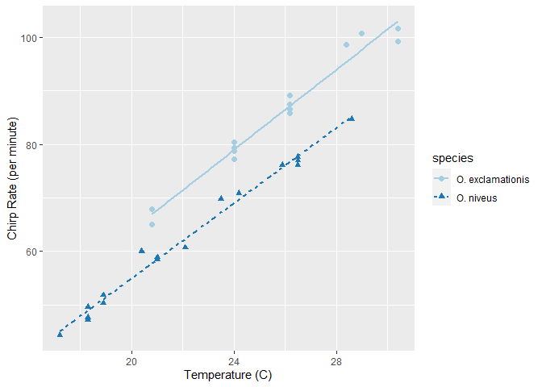
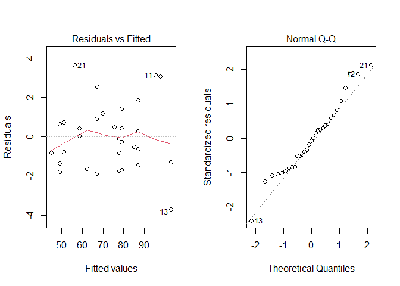

R Modeling Fundamentals
================
Mubarak Ganiyu
6/1/2022

### Package Installation

``` r
library(tidymodels)
```

    ## -- Attaching packages -------------------------------------- tidymodels 0.2.0 --

    ## v broom        0.8.0     v recipes      0.2.0
    ## v dials        0.1.1     v rsample      0.1.1
    ## v dplyr        1.0.9     v tibble       3.1.6
    ## v ggplot2      3.3.5     v tidyr        1.2.0
    ## v infer        1.0.0     v tune         0.2.0
    ## v modeldata    0.1.1     v workflows    0.2.6
    ## v parsnip      0.2.1     v workflowsets 0.2.1
    ## v purrr        0.3.4     v yardstick    0.0.9

    ## -- Conflicts ----------------------------------------- tidymodels_conflicts() --
    ## x purrr::discard() masks scales::discard()
    ## x dplyr::filter()  masks stats::filter()
    ## x dplyr::lag()     masks stats::lag()
    ## x recipes::step()  masks stats::step()
    ## * Learn how to get started at https://www.tidymodels.org/start/

``` r
library(tidyverse)
```

    ## -- Attaching packages --------------------------------------- tidyverse 1.3.1 --

    ## v readr   2.1.1     v forcats 0.5.1
    ## v stringr 1.4.0

    ## -- Conflicts ------------------------------------------ tidyverse_conflicts() --
    ## x readr::col_factor() masks scales::col_factor()
    ## x purrr::discard()    masks scales::discard()
    ## x dplyr::filter()     masks stats::filter()
    ## x stringr::fixed()    masks recipes::fixed()
    ## x dplyr::lag()        masks stats::lag()
    ## x readr::spec()       masks yardstick::spec()

### An Example

``` r
data(crickets, package = "modeldata")
names(crickets)
```

    ## [1] "species" "temp"    "rate"

``` r
ggplot(crickets, 
       aes(x = temp, y = rate, color = species, pch = species, lty = species)) +
  geom_point(size = 2) +
  geom_smooth(method = lm, se = FALSE, alpha = 0.5) +
  scale_color_brewer(palette = "Paired") +
  labs(x = "Temperature (C)", y = "Chirp Rate (per minute)")
```

    ## `geom_smooth()` using formula 'y ~ x'

<!-- -->
### Modeling Test

``` r
interaction_fit <- lm(rate ~ (temp + species)^2, data = crickets)
interaction_fit
```

    ## 
    ## Call:
    ## lm(formula = rate ~ (temp + species)^2, data = crickets)
    ## 
    ## Coefficients:
    ##           (Intercept)                   temp       speciesO. niveus  
    ##               -11.041                  3.751                 -4.348  
    ## temp:speciesO. niveus  
    ##                -0.234

``` r
par(mfrow=c(1,2))
plot(interaction_fit, which = 1)
plot(interaction_fit, which = 2)
```

<!-- -->
### Comparison of two models to test for importance of interaction

``` r
# Fit a reduced model:
main_effect_fit <-  lm(rate ~ temp + species, data = crickets)

# Compare the two:
anova(main_effect_fit, interaction_fit)
```

    ## Analysis of Variance Table
    ## 
    ## Model 1: rate ~ temp + species
    ## Model 2: rate ~ (temp + species)^2
    ##   Res.Df    RSS Df Sum of Sq     F Pr(>F)
    ## 1     28 89.350                          
    ## 2     27 85.074  1    4.2758 1.357 0.2542

``` r
summary(main_effect_fit)
```

    ## 
    ## Call:
    ## lm(formula = rate ~ temp + species, data = crickets)
    ## 
    ## Residuals:
    ##     Min      1Q  Median      3Q     Max 
    ## -3.0128 -1.1296 -0.3912  0.9650  3.7800 
    ## 
    ## Coefficients:
    ##                   Estimate Std. Error t value Pr(>|t|)    
    ## (Intercept)       -7.21091    2.55094  -2.827  0.00858 ** 
    ## temp               3.60275    0.09729  37.032  < 2e-16 ***
    ## speciesO. niveus -10.06529    0.73526 -13.689 6.27e-14 ***
    ## ---
    ## Signif. codes:  0 '***' 0.001 '**' 0.01 '*' 0.05 '.' 0.1 ' ' 1
    ## 
    ## Residual standard error: 1.786 on 28 degrees of freedom
    ## Multiple R-squared:  0.9896, Adjusted R-squared:  0.9888 
    ## F-statistic:  1331 on 2 and 28 DF,  p-value: < 2.2e-16

### Making predictions

``` r
new_values <- data.frame(species = "O. exclamationis", temp = 15:20)
predict(main_effect_fit, new_values)
```

    ##        1        2        3        4        5        6 
    ## 46.83039 50.43314 54.03589 57.63865 61.24140 64.84415

### Using na.fail or na.omit

``` r
# Add a missing value to the prediction set
new_values$temp[1] <- NA

# The predict method for `lm` defaults to `na.pass`:
predict(main_effect_fit, new_values)
```

    ##        1        2        3        4        5        6 
    ##       NA 50.43314 54.03589 57.63865 61.24140 64.84415

``` r
# Alternatively
#predict(main_effect_fit, new_values, na.action = na.fail)

predict(main_effect_fit, new_values, na.action = na.omit)
```

    ##        2        3        4        5        6 
    ## 50.43314 54.03589 57.63865 61.24140 64.84415

### Combining R Models and The Tidyverse

``` r
split_by_species <-
  crickets %>%
  group_nest(species)
split_by_species
```

    ## # A tibble: 2 x 2
    ##   species                        data
    ##   <fct>            <list<tibble[,2]>>
    ## 1 O. exclamationis           [14 x 2]
    ## 2 O. niveus                  [17 x 2]

``` r
model_by_species <-
  split_by_species %>%
  mutate(model = map(data, ~ lm(rate ~ temp, data = .x)))
model_by_species
```

    ## # A tibble: 2 x 3
    ##   species                        data model 
    ##   <fct>            <list<tibble[,2]>> <list>
    ## 1 O. exclamationis           [14 x 2] <lm>  
    ## 2 O. niveus                  [17 x 2] <lm>

``` r
model_by_species %>%
  mutate(coef = map(model, tidy)) %>%
  select(species, coef) %>%
  unnest(cols = c(coef))
```

    ## # A tibble: 4 x 6
    ##   species          term        estimate std.error statistic  p.value
    ##   <fct>            <chr>          <dbl>     <dbl>     <dbl>    <dbl>
    ## 1 O. exclamationis (Intercept)   -11.0      4.77      -2.32 3.90e- 2
    ## 2 O. exclamationis temp            3.75     0.184     20.4  1.10e-10
    ## 3 O. niveus        (Intercept)   -15.4      2.35      -6.56 9.07e- 6
    ## 4 O. niveus        temp            3.52     0.105     33.6  1.57e-15

``` r
library(conflicted)
conflict_prefer("filter", winner = "dplyr")
```

    ## [conflicted] Will prefer dplyr::filter over any other package

``` r
tidymodels_prefer(quiet = FALSE)
```

    ## [conflicted] Removing existing preference
    ## [conflicted] Will prefer dplyr::filter over any other package
    ## [conflicted] Will prefer dplyr::select over any other package
    ## [conflicted] Will prefer dplyr::slice over any other package
    ## [conflicted] Will prefer dplyr::rename over any other package
    ## [conflicted] Will prefer dials::neighbors over any other package
    ## [conflicted] Will prefer parsnip::fit over any other package
    ## [conflicted] Will prefer parsnip::bart over any other package
    ## [conflicted] Will prefer parsnip::pls over any other package
    ## [conflicted] Will prefer purrr::map over any other package
    ## [conflicted] Will prefer recipes::step over any other package
    ## [conflicted] Will prefer themis::step_downsample over any other package
    ## [conflicted] Will prefer themis::step_upsample over any other package
    ## [conflicted] Will prefer tune::tune over any other package
    ## [conflicted] Will prefer yardstick::precision over any other package
    ## [conflicted] Will prefer yardstick::recall over any other package
    ## [conflicted] Will prefer yardstick::spec over any other package
    ## -- Conflicts -------------------------------------------- tidymodels_prefer() --
