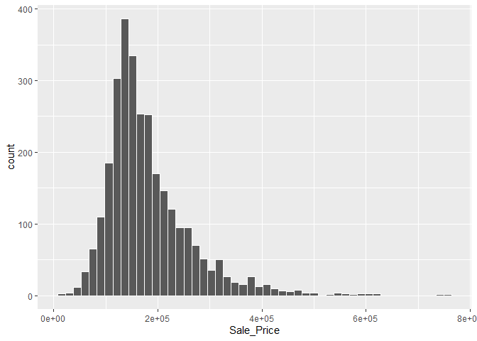
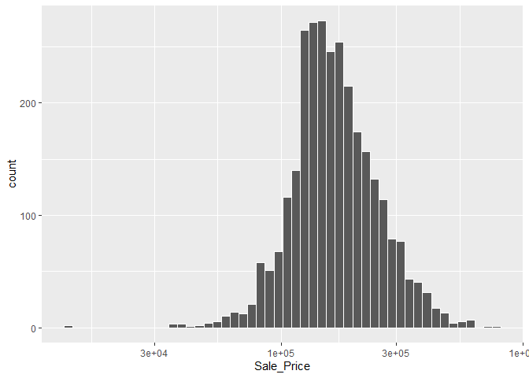

Ames Housing Dataset
================
Mubarak Ganiyu
6/2/2022

### Package Installation

``` r
library(tidymodels)
```

    ## -- Attaching packages -------------------------------------- tidymodels 0.2.0 --

    ## v broom        0.8.0     v recipes      0.2.0
    ## v dials        0.1.1     v rsample      0.1.1
    ## v dplyr        1.0.9     v tibble       3.1.6
    ## v ggplot2      3.3.5     v tidyr        1.2.0
    ## v infer        1.0.0     v tune         0.2.0
    ## v modeldata    0.1.1     v workflows    0.2.6
    ## v parsnip      0.2.1     v workflowsets 0.2.1
    ## v purrr        0.3.4     v yardstick    0.0.9

    ## -- Conflicts ----------------------------------------- tidymodels_conflicts() --
    ## x purrr::discard() masks scales::discard()
    ## x dplyr::filter()  masks stats::filter()
    ## x dplyr::lag()     masks stats::lag()
    ## x recipes::step()  masks stats::step()
    ## * Search for functions across packages at https://www.tidymodels.org/find/

``` r
library(tidyverse)
```

    ## -- Attaching packages --------------------------------------- tidyverse 1.3.1 --

    ## v readr   2.1.1     v forcats 0.5.1
    ## v stringr 1.4.0

    ## -- Conflicts ------------------------------------------ tidyverse_conflicts() --
    ## x readr::col_factor() masks scales::col_factor()
    ## x purrr::discard()    masks scales::discard()
    ## x dplyr::filter()     masks stats::filter()
    ## x stringr::fixed()    masks recipes::fixed()
    ## x dplyr::lag()        masks stats::lag()
    ## x readr::spec()       masks yardstick::spec()

``` r
tidymodels_prefer()
```

### Loading the data

``` r
library(modeldata)
data(ames)

# or in one line
data(ames, package = "modeldata")

dim(ames)
```

    ## [1] 2930   74

### Exploring feature homes in Ames

``` r
ggplot(ames, aes(x = Sale_Price)) +
  geom_histogram(bins = 50, col = "white")
```

<!-- -->

### Log transformation of housing variables

``` r
ggplot(ames, aes(x = Sale_Price)) +
  geom_histogram(bins = 50, col= "white") +
  scale_x_log10()
```

<!-- -->

``` r
ames <- ames %>% mutate(Sale_Price = log10(Sale_Price))
```
