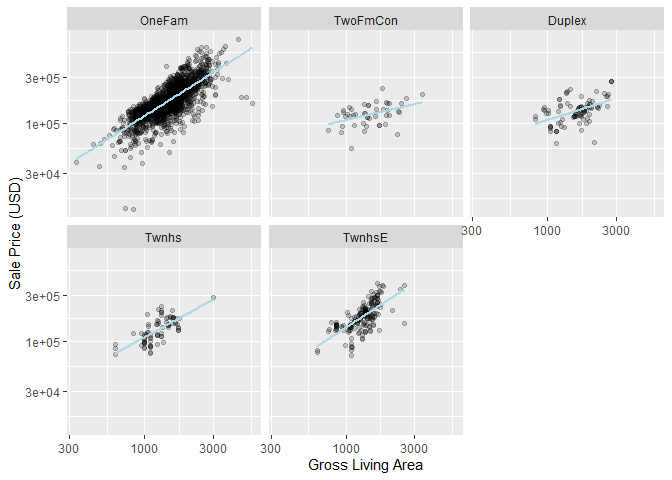
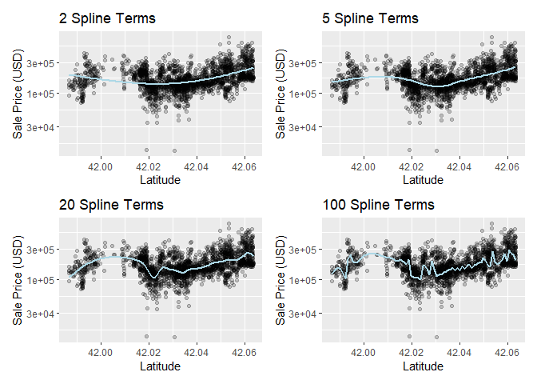

Feature Engineering with recipes
================
Mubarak Ganiyu
2022-06-08

#### Package Installation

``` r
library(tidymodels)
```

    ## -- Attaching packages -------------------------------------- tidymodels 0.2.0 --

    ## v broom        0.8.0     v recipes      0.2.0
    ## v dials        0.1.1     v rsample      0.1.1
    ## v dplyr        1.0.9     v tibble       3.1.6
    ## v ggplot2      3.3.5     v tidyr        1.2.0
    ## v infer        1.0.0     v tune         0.2.0
    ## v modeldata    0.1.1     v workflows    0.2.6
    ## v parsnip      0.2.1     v workflowsets 0.2.1
    ## v purrr        0.3.4     v yardstick    0.0.9

    ## -- Conflicts ----------------------------------------- tidymodels_conflicts() --
    ## x purrr::discard() masks scales::discard()
    ## x dplyr::filter()  masks stats::filter()
    ## x dplyr::lag()     masks stats::lag()
    ## x recipes::step()  masks stats::step()
    ## * Dig deeper into tidy modeling with R at https://www.tmwr.org

``` r
data(ames)

ames <- mutate(ames, Sale_Price = log10(Sale_Price))

set.seed(123)
ames_split <- initial_split(ames, prop = 0.80, strata = Sale_Price)
ames_train <- training(ames_split)
ames_test  <-  testing(ames_split)

lm_model <- linear_reg() %>% set_engine("lm")

lm_wflow <-
  workflow() %>%
  add_model(lm_model) %>%
  add_variables(outcome = Sale_Price, predictors = c(Longitude, Latitude))

lm_fit <- fit(lm_wflow, ames_train)
```

#### Sample Recipe

``` r
simple_ames <- 
  recipe(Sale_Price ~ Neighborhood + Gr_Liv_Area + Year_Built + Bldg_Type, data = ames_train) %>% 
  step_log(Gr_Liv_Area, base = 10) %>% 
  step_dummy(all_nominal_predictors())
simple_ames
```

    ## Recipe
    ## 
    ## Inputs:
    ## 
    ##       role #variables
    ##    outcome          1
    ##  predictor          4
    ## 
    ## Operations:
    ## 
    ## Log transformation on Gr_Liv_Area
    ## Dummy variables from all_nominal_predictors()

#### Adding preprocessor to a workflow

``` r
lm_wflow <- 
  lm_wflow %>% 
  remove_variables() %>% 
  add_recipe(simple_ames)

lm_wflow
```

    ## == Workflow ====================================================================
    ## Preprocessor: Recipe
    ## Model: linear_reg()
    ## 
    ## -- Preprocessor ----------------------------------------------------------------
    ## 2 Recipe Steps
    ## 
    ## * step_log()
    ## * step_dummy()
    ## 
    ## -- Model -----------------------------------------------------------------------
    ## Linear Regression Model Specification (regression)
    ## 
    ## Computational engine: lm

``` r
lm_fit <- fit(lm_wflow, ames_train)
```

``` r
predict(lm_fit, ames_test %>% slice(1:3))
```

    ## Warning in predict.lm(object = object$fit, newdata = new_data, type =
    ## "response"): prediction from a rank-deficient fit may be misleading

    ## # A tibble: 3 x 1
    ##   .pred
    ##   <dbl>
    ## 1  5.07
    ## 2  5.17
    ## 3  5.27

#### Extracting model information

``` r
lm_fit %>%
  extract_recipe(estimated = TRUE)
```

    ## Recipe
    ## 
    ## Inputs:
    ## 
    ##       role #variables
    ##    outcome          1
    ##  predictor          4
    ## 
    ## Training data contained 2342 data points and no missing data.
    ## 
    ## Operations:
    ## 
    ## Log transformation on Gr_Liv_Area [trained]
    ## Dummy variables from Neighborhood, Bldg_Type [trained]

``` r
lm_fit %>% 
  extract_fit_parsnip() %>% 
  tidy() %>% 
  slice(1:10)
```

    ## # A tibble: 10 x 5
    ##    term                            estimate std.error statistic   p.value
    ##    <chr>                              <dbl>     <dbl>     <dbl>     <dbl>
    ##  1 (Intercept)                     -0.682    0.228       -2.99  2.78e-  3
    ##  2 Gr_Liv_Area                      0.625    0.0140      44.8   1.36e-315
    ##  3 Year_Built                       0.00199  0.000115    17.3   6.19e- 63
    ##  4 Neighborhood_College_Creek       0.0167   0.00807      2.06  3.91e-  2
    ##  5 Neighborhood_Old_Town           -0.0357   0.00844     -4.22  2.50e-  5
    ##  6 Neighborhood_Edwards            -0.0531   0.00755     -7.04  2.57e- 12
    ##  7 Neighborhood_Somerset            0.0562   0.00950      5.92  3.71e-  9
    ##  8 Neighborhood_Northridge_Heights  0.132    0.0101      13.1   5.52e- 38
    ##  9 Neighborhood_Gilbert            -0.0317   0.00927     -3.42  6.26e-  4
    ## 10 Neighborhood_Sawyer             -0.00501  0.00839     -0.598 5.50e-  1

#### Utilizing the step functionality

``` r
simple_ames <-
  recipe(Sale_Price ~ Neighborhood + Gr_Liv_Area + Year_Built + Bldg_Type,
         data = ames_train) %>%
  step_log(Gr_Liv_Area, base = 10) %>%
  step_other(Neighborhood, threshold = 0.01) %>%
  step_dummy(all_nominal_predictors())
```

#### Interaction terms

``` r
ggplot(ames_train, aes(x = Gr_Liv_Area, y = 10^Sale_Price)) +
  geom_point(alpha = .2) +
  facet_wrap(~ Bldg_Type) +
  geom_smooth(method = lm, formula = y ~ x, se = FALSE, color = "lightblue") +
  scale_x_log10() +
  scale_y_log10() +
  labs(x = "Gross Living Area", y = "Sale Price (USD)")
```

<!-- -->
\#### Adding interaction terms

``` r
simple_ames <-
  recipe(Sale_Price ~ Neighborhood + Gr_Liv_Area + Year_Built + Bldg_Type,
         data = ames_train) %>%
  step_log(Gr_Liv_Area, base = 10) %>%
  step_other(Neighborhood, threshold = 0.01) %>%
  step_dummy(all_nominal_predictors()) %>%
  # Gr_Liv_Area is on the log scale from a previous step
  step_interact( ~ Gr_Liv_Area:starts_with("Bldg_Type_") )
```

#### Splines

``` r
library(patchwork)
library(splines)

plot_smoother <- function(deg_free) {
  ggplot(ames_train, aes(x = Latitude, y = 10^Sale_Price)) +
    geom_point(alpha = .2) +
    scale_y_log10() +
    geom_smooth(
      method = lm,
      formula = y ~ ns(x, df = deg_free),
      color = "lightblue",
      se = FALSE
    ) +
    labs(title = paste(deg_free, "Spline Terms"),
         y = "Sale Price (USD)")
}

( plot_smoother(2) + plot_smoother(5) ) / ( plot_smoother(20) + plot_smoother(100) )
```

<!-- -->

``` r
recipe(Sale_Price ~ Neighborhood + Gr_Liv_Area + Year_Built + Bldg_Type + Latitude,
         data = ames_train) %>%
  step_log(Gr_Liv_Area, base = 10) %>%
  step_other(Neighborhood, threshold = 0.01) %>%
  step_dummy(all_nominal_predictors()) %>%
  step_interact( ~ Gr_Liv_Area:starts_with("Bldg_Type_") ) %>%
  step_ns(Latitude, deg_free = 20)
```

    ## Recipe
    ## 
    ## Inputs:
    ## 
    ##       role #variables
    ##    outcome          1
    ##  predictor          5
    ## 
    ## Operations:
    ## 
    ## Log transformation on Gr_Liv_Area
    ## Collapsing factor levels for Neighborhood
    ## Dummy variables from all_nominal_predictors()
    ## Interactions with Gr_Liv_Area:starts_with("Bldg_Type_")
    ## Natural splines on Latitude

#### Tidy a recipe()

``` r
ames_rec <-
  recipe(Sale_Price ~ Neighborhood + Gr_Liv_Area + Year_Built + Bldg_Type +
           Latitude + Longitude, data = ames_train) %>%
  step_log(Gr_Liv_Area, base = 10) %>%
  step_other(Neighborhood, threshold = 0.01) %>%
  step_dummy(all_nominal_predictors()) %>%
  step_interact( ~ Gr_Liv_Area:starts_with("Bldg_Type_") ) %>%
  step_ns(Latitude, Longitude, deg_free = 20)

tidy(ames_rec)
```

    ## # A tibble: 5 x 6
    ##   number operation type     trained skip  id            
    ##    <int> <chr>     <chr>    <lgl>   <lgl> <chr>         
    ## 1      1 step      log      FALSE   FALSE log_bDlz5     
    ## 2      2 step      other    FALSE   FALSE other_WmExf   
    ## 3      3 step      dummy    FALSE   FALSE dummy_1MbxZ   
    ## 4      4 step      interact FALSE   FALSE interact_UcdLo
    ## 5      5 step      ns       FALSE   FALSE ns_zQ4Jj

``` r
ames_rec <-
  recipe(Sale_Price ~ Neighborhood + Gr_Liv_Area + Year_Built + Bldg_Type +
           Latitude + Longitude, data = ames_train) %>%
  step_log(Gr_Liv_Area, base = 10) %>%
  step_other(Neighborhood, threshold = 0.01, id = "my_id") %>%
  step_dummy(all_nominal_predictors()) %>%
  step_interact( ~ Gr_Liv_Area:starts_with("Bldg_Type_") ) %>%
  step_ns(Latitude, Longitude, deg_free = 20)

tidy(ames_rec)
```

    ## # A tibble: 5 x 6
    ##   number operation type     trained skip  id            
    ##    <int> <chr>     <chr>    <lgl>   <lgl> <chr>         
    ## 1      1 step      log      FALSE   FALSE log_AHXMB     
    ## 2      2 step      other    FALSE   FALSE my_id         
    ## 3      3 step      dummy    FALSE   FALSE dummy_YT3la   
    ## 4      4 step      interact FALSE   FALSE interact_bL7QO
    ## 5      5 step      ns       FALSE   FALSE ns_OO6RY

``` r
lm_wflow <-
  workflow() %>%
  add_model(lm_model) %>%
  add_recipe(ames_rec)

lm_fit <- fit(lm_wflow, ames_train)
```

``` r
estimated_recipe <-
  lm_fit %>%
  extract_recipe(estimated = TRUE)

tidy(estimated_recipe, id = "my_id") # extracting specific preprocessing steps with regards to their ids
```

    ## # A tibble: 21 x 3
    ##    terms        retained           id   
    ##    <chr>        <chr>              <chr>
    ##  1 Neighborhood North_Ames         my_id
    ##  2 Neighborhood College_Creek      my_id
    ##  3 Neighborhood Old_Town           my_id
    ##  4 Neighborhood Edwards            my_id
    ##  5 Neighborhood Somerset           my_id
    ##  6 Neighborhood Northridge_Heights my_id
    ##  7 Neighborhood Gilbert            my_id
    ##  8 Neighborhood Sawyer             my_id
    ##  9 Neighborhood Northwest_Ames     my_id
    ## 10 Neighborhood Sawyer_West        my_id
    ## # ... with 11 more rows

``` r
tidy(estimated_recipe, number = 2)
```

    ## # A tibble: 21 x 3
    ##    terms        retained           id   
    ##    <chr>        <chr>              <chr>
    ##  1 Neighborhood North_Ames         my_id
    ##  2 Neighborhood College_Creek      my_id
    ##  3 Neighborhood Old_Town           my_id
    ##  4 Neighborhood Edwards            my_id
    ##  5 Neighborhood Somerset           my_id
    ##  6 Neighborhood Northridge_Heights my_id
    ##  7 Neighborhood Gilbert            my_id
    ##  8 Neighborhood Sawyer             my_id
    ##  9 Neighborhood Northwest_Ames     my_id
    ## 10 Neighborhood Sawyer_West        my_id
    ## # ... with 11 more rows

``` r
#ames_rec %>% update_role(address, new_role = "street address") 
# for updating the function of a column (i.e. this is for columns 
# that are not going to serve as predictors but want to be retained.)
```
