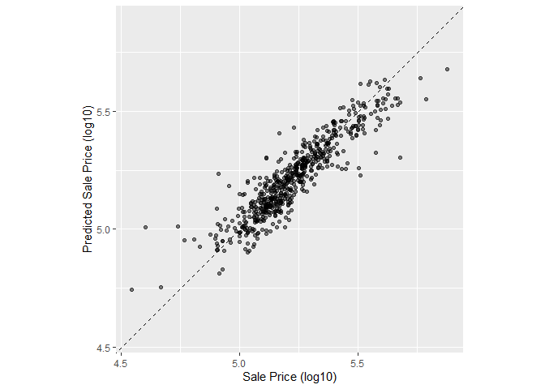
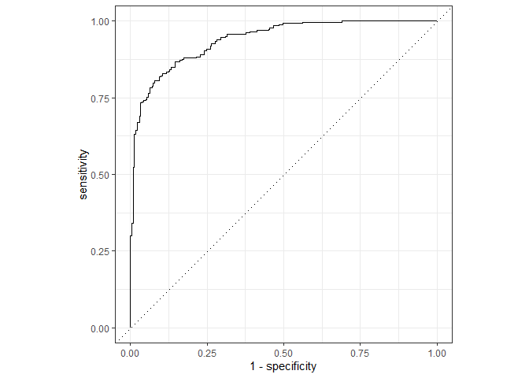
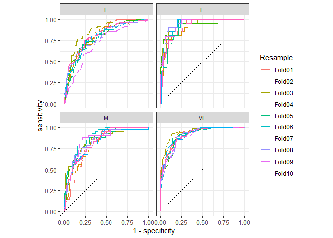

Judging Model Effectiveness
================
Mubarak Ganiyu
2022-06-09

## Package Installation

``` r
library(tidymodels)
```

    ## -- Attaching packages -------------------------------------- tidymodels 0.2.0 --

    ## v broom        0.8.0     v recipes      0.2.0
    ## v dials        0.1.1     v rsample      0.1.1
    ## v dplyr        1.0.9     v tibble       3.1.6
    ## v ggplot2      3.3.5     v tidyr        1.2.0
    ## v infer        1.0.0     v tune         0.2.0
    ## v modeldata    0.1.1     v workflows    0.2.6
    ## v parsnip      0.2.1     v workflowsets 0.2.1
    ## v purrr        0.3.4     v yardstick    0.0.9

    ## -- Conflicts ----------------------------------------- tidymodels_conflicts() --
    ## x purrr::discard() masks scales::discard()
    ## x dplyr::filter()  masks stats::filter()
    ## x dplyr::lag()     masks stats::lag()
    ## x recipes::step()  masks stats::step()
    ## * Search for functions across packages at https://www.tidymodels.org/find/

``` r
data(ames)
ames <- mutate(ames, Sale_Price = log10(Sale_Price))

set.seed(123)
ames_split <- initial_split(ames, prop = 0.80, strata = Sale_Price)
ames_train <- training(ames_split)
ames_test  <-  testing(ames_split)

ames_rec <-
  recipe(Sale_Price ~ Neighborhood + Gr_Liv_Area + Year_Built + Bldg_Type +
           Latitude + Longitude, data = ames_train) %>%
  step_log(Gr_Liv_Area, base = 10) %>%
  step_other(Neighborhood, threshold = 0.01) %>%
  step_dummy(all_nominal_predictors()) %>%
  step_interact( ~ Gr_Liv_Area:starts_with("Bldg_Type_") ) %>%
  step_ns(Latitude, Longitude, deg_free = 20)

lm_model <- linear_reg() %>% set_engine("lm")

lm_wflow <-
  workflow() %>%
  add_model(lm_model) %>%
  add_recipe(ames_rec)

lm_fit <- fit(lm_wflow, ames_train)
```

#### Regression Metrics

``` r
ames_test_res <- predict(lm_fit, new_data = ames_test %>% select(-Sale_Price))
ames_test_res
```

    ## # A tibble: 588 x 1
    ##    .pred
    ##    <dbl>
    ##  1  5.07
    ##  2  5.17
    ##  3  5.28
    ##  4  5.05
    ##  5  5.51
    ##  6  5.42
    ##  7  5.55
    ##  8  5.33
    ##  9  5.23
    ## 10  5.53
    ## # ... with 578 more rows

``` r
ames_test_res <- bind_cols(ames_test_res, ames_test %>% select(Sale_Price))
ames_test_res
```

    ## # A tibble: 588 x 2
    ##    .pred Sale_Price
    ##    <dbl>      <dbl>
    ##  1  5.07       5.02
    ##  2  5.17       5.24
    ##  3  5.28       5.28
    ##  4  5.05       5.06
    ##  5  5.51       5.60
    ##  6  5.42       5.33
    ##  7  5.55       5.79
    ##  8  5.33       5.24
    ##  9  5.23       5.27
    ## 10  5.53       5.52
    ## # ... with 578 more rows

``` r
ggplot(ames_test_res, aes(x = Sale_Price, y = .pred)) +
  # Create a diagonal line:
  geom_abline(lty = 2) +
  geom_point(alpha = 0.5) +
  labs(y = "Predicted Sale Price (log10)", x = "Sale Price (log10)") +
  # Scale and size the x- and y-axis uniformly:
  coord_obs_pred()
```

<!-- -->

``` r
rmse(ames_test_res, truth = Sale_Price, estimate = .pred)
```

    ## # A tibble: 1 x 3
    ##   .metric .estimator .estimate
    ##   <chr>   <chr>          <dbl>
    ## 1 rmse    standard      0.0754

For computing numerous metrics at once, we use metric set

``` r
ames_metrics <- metric_set(rmse, rsq, mae)
ames_metrics(ames_test_res, truth = Sale_Price, estimate = .pred)
```

    ## # A tibble: 3 x 3
    ##   .metric .estimator .estimate
    ##   <chr>   <chr>          <dbl>
    ## 1 rmse    standard      0.0754
    ## 2 rsq     standard      0.826 
    ## 3 mae     standard      0.0546

#### Binary Classification Metrics

``` r
data(two_class_example)
tibble(two_class_example)
```

    ## # A tibble: 500 x 4
    ##    truth   Class1   Class2 predicted
    ##    <fct>    <dbl>    <dbl> <fct>    
    ##  1 Class2 0.00359 0.996    Class2   
    ##  2 Class1 0.679   0.321    Class1   
    ##  3 Class2 0.111   0.889    Class2   
    ##  4 Class1 0.735   0.265    Class1   
    ##  5 Class2 0.0162  0.984    Class2   
    ##  6 Class1 0.999   0.000725 Class1   
    ##  7 Class1 0.999   0.000799 Class1   
    ##  8 Class1 0.812   0.188    Class1   
    ##  9 Class2 0.457   0.543    Class2   
    ## 10 Class2 0.0976  0.902    Class2   
    ## # ... with 490 more rows

``` r
conf_mat(two_class_example, truth = truth, estimate = predicted)
```

    ##           Truth
    ## Prediction Class1 Class2
    ##     Class1    227     50
    ##     Class2     31    192

``` r
accuracy(two_class_example, truth, predicted)
```

    ## # A tibble: 1 x 3
    ##   .metric  .estimator .estimate
    ##   <chr>    <chr>          <dbl>
    ## 1 accuracy binary         0.838

``` r
# Matthews correlation coefficient:
mcc(two_class_example, truth, predicted)
```

    ## # A tibble: 1 x 3
    ##   .metric .estimator .estimate
    ##   <chr>   <chr>          <dbl>
    ## 1 mcc     binary         0.677

``` r
# F1 metric:
f_meas(two_class_example, truth, predicted)
```

    ## # A tibble: 1 x 3
    ##   .metric .estimator .estimate
    ##   <chr>   <chr>          <dbl>
    ## 1 f_meas  binary         0.849

``` r
# Combining these three classification metrics together
classification_metrics <- metric_set(accuracy, mcc, f_meas)
classification_metrics(two_class_example, truth = truth, estimate = predicted)
```

    ## # A tibble: 3 x 3
    ##   .metric  .estimator .estimate
    ##   <chr>    <chr>          <dbl>
    ## 1 accuracy binary         0.838
    ## 2 mcc      binary         0.677
    ## 3 f_meas   binary         0.849

``` r
f_meas(two_class_example, truth, predicted, event_level = "second")
```

    ## # A tibble: 1 x 3
    ##   .metric .estimator .estimate
    ##   <chr>   <chr>          <dbl>
    ## 1 f_meas  binary         0.826

``` r
two_class_curve <- roc_curve(two_class_example, truth, Class1)
two_class_curve
```

    ## # A tibble: 502 x 3
    ##    .threshold specificity sensitivity
    ##         <dbl>       <dbl>       <dbl>
    ##  1 -Inf           0                 1
    ##  2    1.79e-7     0                 1
    ##  3    4.50e-6     0.00413           1
    ##  4    5.81e-6     0.00826           1
    ##  5    5.92e-6     0.0124            1
    ##  6    1.22e-5     0.0165            1
    ##  7    1.40e-5     0.0207            1
    ##  8    1.43e-5     0.0248            1
    ##  9    2.38e-5     0.0289            1
    ## 10    3.30e-5     0.0331            1
    ## # ... with 492 more rows

``` r
roc_auc(two_class_example, truth, Class1)
```

    ## # A tibble: 1 x 3
    ##   .metric .estimator .estimate
    ##   <chr>   <chr>          <dbl>
    ## 1 roc_auc binary         0.939

``` r
autoplot(two_class_curve)
```

<!-- -->

#### Multi-Class Classification Metrics

``` r
data(hpc_cv)
tibble(hpc_cv)
```

    ## # A tibble: 3,467 x 7
    ##    obs   pred     VF      F       M          L Resample
    ##    <fct> <fct> <dbl>  <dbl>   <dbl>      <dbl> <chr>   
    ##  1 VF    VF    0.914 0.0779 0.00848 0.0000199  Fold01  
    ##  2 VF    VF    0.938 0.0571 0.00482 0.0000101  Fold01  
    ##  3 VF    VF    0.947 0.0495 0.00316 0.00000500 Fold01  
    ##  4 VF    VF    0.929 0.0653 0.00579 0.0000156  Fold01  
    ##  5 VF    VF    0.942 0.0543 0.00381 0.00000729 Fold01  
    ##  6 VF    VF    0.951 0.0462 0.00272 0.00000384 Fold01  
    ##  7 VF    VF    0.914 0.0782 0.00767 0.0000354  Fold01  
    ##  8 VF    VF    0.918 0.0744 0.00726 0.0000157  Fold01  
    ##  9 VF    VF    0.843 0.128  0.0296  0.000192   Fold01  
    ## 10 VF    VF    0.920 0.0728 0.00703 0.0000147  Fold01  
    ## # ... with 3,457 more rows

``` r
accuracy(hpc_cv, obs, pred)
```

    ## # A tibble: 1 x 3
    ##   .metric  .estimator .estimate
    ##   <chr>    <chr>          <dbl>
    ## 1 accuracy multiclass     0.709

``` r
mcc(hpc_cv, obs, pred)
```

    ## # A tibble: 1 x 3
    ##   .metric .estimator .estimate
    ##   <chr>   <chr>          <dbl>
    ## 1 mcc     multiclass     0.515

``` r
class_totals <-
  count(hpc_cv, obs, name = "totals") %>%
  mutate(class_wts = totals / sum(totals))
class_totals
```

    ##   obs totals  class_wts
    ## 1  VF   1769 0.51023940
    ## 2   F   1078 0.31093164
    ## 3   M    412 0.11883473
    ## 4   L    208 0.05999423

``` r
cell_counts <-
  hpc_cv %>%
  group_by(obs, pred) %>%
  count() %>%
  ungroup()

# Compute the four sensitivities using 1-vs-all
one_versus_all <-
  cell_counts %>%
  filter(obs == pred) %>%
  full_join(class_totals, by = "obs") %>%
  mutate(sens = n / totals)

one_versus_all
```

    ## # A tibble: 4 x 6
    ##   obs   pred      n totals class_wts  sens
    ##   <fct> <fct> <int>  <int>     <dbl> <dbl>
    ## 1 VF    VF     1620   1769    0.510  0.916
    ## 2 F     F       647   1078    0.311  0.600
    ## 3 M     M        79    412    0.119  0.192
    ## 4 L     L       111    208    0.0600 0.534

``` r
# Three different estimates:
one_versus_all %>%
  summarize(
    macro = mean(sens),
    macro_wts = weighted.mean(sens, class_wts),
    micro = sum(n) / sum(totals)
  )
```

    ## # A tibble: 1 x 3
    ##   macro macro_wts micro
    ##   <dbl>     <dbl> <dbl>
    ## 1 0.560     0.709 0.709

``` r
sensitivity(hpc_cv, obs, pred, estimator = "macro")
```

    ## # A tibble: 1 x 3
    ##   .metric     .estimator .estimate
    ##   <chr>       <chr>          <dbl>
    ## 1 sensitivity macro          0.560

``` r
sensitivity(hpc_cv, obs, pred, estimator = "macro_weighted")
```

    ## # A tibble: 1 x 3
    ##   .metric     .estimator     .estimate
    ##   <chr>       <chr>              <dbl>
    ## 1 sensitivity macro_weighted     0.709

``` r
sensitivity(hpc_cv, obs, pred, estimator = "micro")
```

    ## # A tibble: 1 x 3
    ##   .metric     .estimator .estimate
    ##   <chr>       <chr>          <dbl>
    ## 1 sensitivity micro          0.709

``` r
roc_auc(hpc_cv, obs, VF, F, M, L)
```

    ## # A tibble: 1 x 3
    ##   .metric .estimator .estimate
    ##   <chr>   <chr>          <dbl>
    ## 1 roc_auc hand_till      0.829

``` r
roc_auc(hpc_cv, obs, VF, F, M, L, estimator = "macro_weighted")
```

    ## # A tibble: 1 x 3
    ##   .metric .estimator     .estimate
    ##   <chr>   <chr>              <dbl>
    ## 1 roc_auc macro_weighted     0.868

``` r
hpc_cv %>%
  group_by(Resample) %>%
  accuracy(obs, pred)
```

    ## # A tibble: 10 x 4
    ##    Resample .metric  .estimator .estimate
    ##    <chr>    <chr>    <chr>          <dbl>
    ##  1 Fold01   accuracy multiclass     0.726
    ##  2 Fold02   accuracy multiclass     0.712
    ##  3 Fold03   accuracy multiclass     0.758
    ##  4 Fold04   accuracy multiclass     0.712
    ##  5 Fold05   accuracy multiclass     0.712
    ##  6 Fold06   accuracy multiclass     0.697
    ##  7 Fold07   accuracy multiclass     0.675
    ##  8 Fold08   accuracy multiclass     0.721
    ##  9 Fold09   accuracy multiclass     0.673
    ## 10 Fold10   accuracy multiclass     0.699

``` r
# Four 1-vs-all ROC curves for each fold
hpc_cv %>%
  group_by(Resample) %>%
  roc_curve(obs, VF, F, M, L) %>%
  autoplot()
```

<!-- -->
