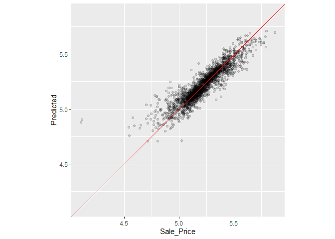

Resampling for Evaluating Performance
================
Mubarak Ganiyu
2022-06-11

### Package Installation

``` r
library(tidymodels)
```

    ## -- Attaching packages -------------------------------------- tidymodels 0.2.0 --

    ## v broom        0.8.0     v recipes      0.2.0
    ## v dials        0.1.1     v rsample      0.1.1
    ## v dplyr        1.0.9     v tibble       3.1.6
    ## v ggplot2      3.3.5     v tidyr        1.2.0
    ## v infer        1.0.0     v tune         0.2.0
    ## v modeldata    0.1.1     v workflows    0.2.6
    ## v parsnip      0.2.1     v workflowsets 0.2.1
    ## v purrr        0.3.4     v yardstick    0.0.9

    ## -- Conflicts ----------------------------------------- tidymodels_conflicts() --
    ## x purrr::discard() masks scales::discard()
    ## x dplyr::filter()  masks stats::filter()
    ## x dplyr::lag()     masks stats::lag()
    ## x recipes::step()  masks stats::step()
    ## * Dig deeper into tidy modeling with R at https://www.tmwr.org

``` r
data(ames)
ames <- mutate(ames, Sale_Price = log10(Sale_Price))

set.seed(123)
ames_split <- initial_split(ames, prop = 0.80, strata = Sale_Price)
ames_train <- training(ames_split)
ames_test  <-  testing(ames_split)

ames_rec <-
  recipe(Sale_Price ~ Neighborhood + Gr_Liv_Area + Year_Built + Bldg_Type +
           Latitude + Longitude, data = ames_train) %>%
  step_log(Gr_Liv_Area, base = 10) %>%
  step_other(Neighborhood, threshold = 0.01) %>%
  step_dummy(all_nominal_predictors()) %>%
  step_interact( ~ Gr_Liv_Area:starts_with("Bldg_Type_") ) %>%
  step_ns(Latitude, Longitude, deg_free = 20)

lm_model <- linear_reg() %>% set_engine("lm")

lm_wflow <-
  workflow() %>%
  add_model(lm_model) %>%
  add_recipe(ames_rec)

lm_fit <- fit(lm_wflow, ames_train)
```

#### The Resubsitution Approach

``` r
rf_model <-
  rand_forest(trees = 1000) %>%
  set_engine("ranger") %>%
  set_mode("regression")

rf_wflow <-
  workflow() %>%
  add_formula(
    Sale_Price ~ Neighborhood + Gr_Liv_Area + Year_Built + Bldg_Type +
      Latitude + Longitude) %>%
  add_model(rf_model)

rf_fit <- rf_wflow %>% fit(data = ames_train)
```

#### Function for estimating performance

``` r
estimate_perf <- function(model, dat) {
  # Capture the names of the `model` and `dat` objects
  cl <- match.call()
  obj_name <- as.character(cl$model)
  data_name <- as.character(cl$dat)
  data_name <- gsub("ames_", "", data_name)

  # Estimate these metrics:
  reg_metrics <- metric_set(rmse, rsq)

  model %>%
    predict(dat) %>%
    bind_cols(dat %>% select(Sale_Price)) %>%
    reg_metrics(Sale_Price, .pred) %>%
    select(-.estimator) %>%
    mutate(object = obj_name, data = data_name)
}
```

#### Performance metrics’ outcomes for training set

``` r
estimate_perf(rf_fit, ames_train)
```

    ## # A tibble: 2 x 4
    ##   .metric .estimate object data 
    ##   <chr>       <dbl> <chr>  <chr>
    ## 1 rmse       0.0367 rf_fit train
    ## 2 rsq        0.960  rf_fit train

``` r
estimate_perf(lm_fit, ames_train)
```

    ## # A tibble: 2 x 4
    ##   .metric .estimate object data 
    ##   <chr>       <dbl> <chr>  <chr>
    ## 1 rmse       0.0751 lm_fit train
    ## 2 rsq        0.819  lm_fit train

#### Performance metrics’ outcomes for test set

``` r
estimate_perf(rf_fit, ames_test)
```

    ## # A tibble: 2 x 4
    ##   .metric .estimate object data 
    ##   <chr>       <dbl> <chr>  <chr>
    ## 1 rmse       0.0694 rf_fit test 
    ## 2 rsq        0.853  rf_fit test

``` r
estimate_perf(lm_fit, ames_test)
```

    ## # A tibble: 2 x 4
    ##   .metric .estimate object data 
    ##   <chr>       <dbl> <chr>  <chr>
    ## 1 rmse       0.0754 lm_fit test 
    ## 2 rsq        0.826  lm_fit test

#### Cross-validation

``` r
ames_folds <- vfold_cv(ames_train, v = 10)
ames_folds
```

    ## #  10-fold cross-validation 
    ## # A tibble: 10 x 2
    ##    splits             id    
    ##    <list>             <chr> 
    ##  1 <split [2107/235]> Fold01
    ##  2 <split [2107/235]> Fold02
    ##  3 <split [2108/234]> Fold03
    ##  4 <split [2108/234]> Fold04
    ##  5 <split [2108/234]> Fold05
    ##  6 <split [2108/234]> Fold06
    ##  7 <split [2108/234]> Fold07
    ##  8 <split [2108/234]> Fold08
    ##  9 <split [2108/234]> Fold09
    ## 10 <split [2108/234]> Fold10

``` r
# retrieving information from first fold
ames_folds$splits[[1]] %>% analysis() %>% dim()
```

    ## [1] 2107   74

#### Repeated Cross validation

``` r
vfold_cv(ames_train, v = 10, repeats = 5)
```

    ## #  10-fold cross-validation repeated 5 times 
    ## # A tibble: 50 x 3
    ##    splits             id      id2   
    ##    <list>             <chr>   <chr> 
    ##  1 <split [2107/235]> Repeat1 Fold01
    ##  2 <split [2107/235]> Repeat1 Fold02
    ##  3 <split [2108/234]> Repeat1 Fold03
    ##  4 <split [2108/234]> Repeat1 Fold04
    ##  5 <split [2108/234]> Repeat1 Fold05
    ##  6 <split [2108/234]> Repeat1 Fold06
    ##  7 <split [2108/234]> Repeat1 Fold07
    ##  8 <split [2108/234]> Repeat1 Fold08
    ##  9 <split [2108/234]> Repeat1 Fold09
    ## 10 <split [2108/234]> Repeat1 Fold10
    ## # ... with 40 more rows

#### Monte Carlo cross validation

``` r
mc_cv(ames_train, prop = 9/10, times = 20)
```

    ## # Monte Carlo cross-validation (0.9/0.1) with 20 resamples  
    ## # A tibble: 20 x 2
    ##    splits             id        
    ##    <list>             <chr>     
    ##  1 <split [2107/235]> Resample01
    ##  2 <split [2107/235]> Resample02
    ##  3 <split [2107/235]> Resample03
    ##  4 <split [2107/235]> Resample04
    ##  5 <split [2107/235]> Resample05
    ##  6 <split [2107/235]> Resample06
    ##  7 <split [2107/235]> Resample07
    ##  8 <split [2107/235]> Resample08
    ##  9 <split [2107/235]> Resample09
    ## 10 <split [2107/235]> Resample10
    ## 11 <split [2107/235]> Resample11
    ## 12 <split [2107/235]> Resample12
    ## 13 <split [2107/235]> Resample13
    ## 14 <split [2107/235]> Resample14
    ## 15 <split [2107/235]> Resample15
    ## 16 <split [2107/235]> Resample16
    ## 17 <split [2107/235]> Resample17
    ## 18 <split [2107/235]> Resample18
    ## 19 <split [2107/235]> Resample19
    ## 20 <split [2107/235]> Resample20

#### Validation sets

``` r
set.seed(1002)
val_set <- validation_split(ames_train, prop = 3/4)
val_set
```

    ## # Validation Set Split (0.75/0.25)  
    ## # A tibble: 1 x 2
    ##   splits             id        
    ##   <list>             <chr>     
    ## 1 <split [1756/586]> validation

#### Bootstrapping

``` r
bootstraps(ames_train, times = 5)
```

    ## # Bootstrap sampling 
    ## # A tibble: 5 x 2
    ##   splits             id        
    ##   <list>             <chr>     
    ## 1 <split [2342/858]> Bootstrap1
    ## 2 <split [2342/855]> Bootstrap2
    ## 3 <split [2342/852]> Bootstrap3
    ## 4 <split [2342/851]> Bootstrap4
    ## 5 <split [2342/867]> Bootstrap5

#### Rolling forecast origin resampling

``` r
time_slices <-
  tibble(x = 1:365) %>%
  rolling_origin(initial = 6 * 30, assess = 30, skip = 29, cumulative = FALSE)

data_range <- function(x) {
  summarize(x, first = min(x), last = max(x))
}

map_dfr(time_slices$splits, ~   analysis(.x) %>% data_range())
```

    ## # A tibble: 6 x 2
    ##   first  last
    ##   <int> <int>
    ## 1     1   180
    ## 2    31   210
    ## 3    61   240
    ## 4    91   270
    ## 5   121   300
    ## 6   151   330

``` r
map_dfr(time_slices$splits, ~ assessment(.x) %>% data_range())
```

    ## # A tibble: 6 x 2
    ##   first  last
    ##   <int> <int>
    ## 1   181   210
    ## 2   211   240
    ## 3   241   270
    ## 4   271   300
    ## 5   301   330
    ## 6   331   360

#### Estimating Performance

``` r
keep_pred <- control_resamples(save_pred = TRUE, save_workflow = TRUE)

set.seed(1003)
rf_res <-
  rf_wflow %>%
  fit_resamples(resamples = ames_folds, control = keep_pred)
rf_res
```

    ## # Resampling results
    ## # 10-fold cross-validation 
    ## # A tibble: 10 x 5
    ##    splits             id     .metrics         .notes           .predictions     
    ##    <list>             <chr>  <list>           <list>           <list>           
    ##  1 <split [2107/235]> Fold01 <tibble [2 x 4]> <tibble [0 x 3]> <tibble [235 x 4~
    ##  2 <split [2107/235]> Fold02 <tibble [2 x 4]> <tibble [0 x 3]> <tibble [235 x 4~
    ##  3 <split [2108/234]> Fold03 <tibble [2 x 4]> <tibble [0 x 3]> <tibble [234 x 4~
    ##  4 <split [2108/234]> Fold04 <tibble [2 x 4]> <tibble [0 x 3]> <tibble [234 x 4~
    ##  5 <split [2108/234]> Fold05 <tibble [2 x 4]> <tibble [0 x 3]> <tibble [234 x 4~
    ##  6 <split [2108/234]> Fold06 <tibble [2 x 4]> <tibble [0 x 3]> <tibble [234 x 4~
    ##  7 <split [2108/234]> Fold07 <tibble [2 x 4]> <tibble [0 x 3]> <tibble [234 x 4~
    ##  8 <split [2108/234]> Fold08 <tibble [2 x 4]> <tibble [0 x 3]> <tibble [234 x 4~
    ##  9 <split [2108/234]> Fold09 <tibble [2 x 4]> <tibble [0 x 3]> <tibble [234 x 4~
    ## 10 <split [2108/234]> Fold10 <tibble [2 x 4]> <tibble [0 x 3]> <tibble [234 x 4~

``` r
collect_metrics(rf_res)
```

    ## # A tibble: 2 x 6
    ##   .metric .estimator   mean     n std_err .config             
    ##   <chr>   <chr>       <dbl> <int>   <dbl> <chr>               
    ## 1 rmse    standard   0.0718    10 0.00300 Preprocessor1_Model1
    ## 2 rsq     standard   0.833     10 0.0110  Preprocessor1_Model1

``` r
collect_metrics(rf_res, summarize = FALSE)
```

    ## # A tibble: 20 x 5
    ##    id     .metric .estimator .estimate .config             
    ##    <chr>  <chr>   <chr>          <dbl> <chr>               
    ##  1 Fold01 rmse    standard      0.0698 Preprocessor1_Model1
    ##  2 Fold01 rsq     standard      0.846  Preprocessor1_Model1
    ##  3 Fold02 rmse    standard      0.0679 Preprocessor1_Model1
    ##  4 Fold02 rsq     standard      0.844  Preprocessor1_Model1
    ##  5 Fold03 rmse    standard      0.0839 Preprocessor1_Model1
    ##  6 Fold03 rsq     standard      0.795  Preprocessor1_Model1
    ##  7 Fold04 rmse    standard      0.0697 Preprocessor1_Model1
    ##  8 Fold04 rsq     standard      0.838  Preprocessor1_Model1
    ##  9 Fold05 rmse    standard      0.0597 Preprocessor1_Model1
    ## 10 Fold05 rsq     standard      0.865  Preprocessor1_Model1
    ## 11 Fold06 rmse    standard      0.0691 Preprocessor1_Model1
    ## 12 Fold06 rsq     standard      0.837  Preprocessor1_Model1
    ## 13 Fold07 rmse    standard      0.0927 Preprocessor1_Model1
    ## 14 Fold07 rsq     standard      0.753  Preprocessor1_Model1
    ## 15 Fold08 rmse    standard      0.0659 Preprocessor1_Model1
    ## 16 Fold08 rsq     standard      0.873  Preprocessor1_Model1
    ## 17 Fold09 rmse    standard      0.0716 Preprocessor1_Model1
    ## 18 Fold09 rsq     standard      0.840  Preprocessor1_Model1
    ## 19 Fold10 rmse    standard      0.0677 Preprocessor1_Model1
    ## 20 Fold10 rsq     standard      0.844  Preprocessor1_Model1

``` r
assess_res <- collect_predictions(rf_res)
assess_res
```

    ## # A tibble: 2,342 x 5
    ##    id     .pred  .row Sale_Price .config             
    ##    <chr>  <dbl> <int>      <dbl> <chr>               
    ##  1 Fold01  5.01     4       4.94 Preprocessor1_Model1
    ##  2 Fold01  5.14     5       5.11 Preprocessor1_Model1
    ##  3 Fold01  5.11     7       5.10 Preprocessor1_Model1
    ##  4 Fold01  5.13    13       4.93 Preprocessor1_Model1
    ##  5 Fold01  4.98    25       5.04 Preprocessor1_Model1
    ##  6 Fold01  5.02    38       5.04 Preprocessor1_Model1
    ##  7 Fold01  5.12    46       5.10 Preprocessor1_Model1
    ##  8 Fold01  4.99    92       4.91 Preprocessor1_Model1
    ##  9 Fold01  5.15   103       5.10 Preprocessor1_Model1
    ## 10 Fold01  5.12   108       5.09 Preprocessor1_Model1
    ## # ... with 2,332 more rows

``` r
new_df <- assess_res %>% 
  arrange(.row) %>% 
  select(.row, Sale_Price, .pred)
new_df
```

    ## # A tibble: 2,342 x 3
    ##     .row Sale_Price .pred
    ##    <int>      <dbl> <dbl>
    ##  1     1       5.10  5.01
    ##  2     2       4.98  4.99
    ##  3     3       5.02  4.99
    ##  4     4       4.94  5.01
    ##  5     5       5.11  5.14
    ##  6     6       5.08  5.11
    ##  7     7       5.10  5.11
    ##  8     8       4.83  4.99
    ##  9     9       5.05  5.16
    ## 10    10       5.09  5.11
    ## # ... with 2,332 more rows

``` r
assess_res %>%
  ggplot(aes(x = Sale_Price, y = .pred)) +
  geom_point(alpha = .15) +
  geom_abline(color = "red") +
  coord_obs_pred() +
  ylab("Predicted")
```

<!-- -->

``` r
over_predicted <-
  assess_res %>%
  mutate(residual = Sale_Price - .pred) %>%
  arrange(desc(abs(residual))) %>%
  slice(1:2)
over_predicted
```

    ## # A tibble: 2 x 6
    ##   id     .pred  .row Sale_Price .config              residual
    ##   <chr>  <dbl> <int>      <dbl> <chr>                   <dbl>
    ## 1 Fold07  4.90   319       4.12 Preprocessor1_Model1   -0.784
    ## 2 Fold03  4.88    32       4.11 Preprocessor1_Model1   -0.773

``` r
ames_train %>%
  slice(over_predicted$.row) %>%
  select(Gr_Liv_Area, Neighborhood, Year_Built, Bedroom_AbvGr, Full_Bath)
```

    ## # A tibble: 2 x 5
    ##   Gr_Liv_Area Neighborhood           Year_Built Bedroom_AbvGr Full_Bath
    ##         <int> <fct>                       <int>         <int>     <int>
    ## 1         733 Iowa_DOT_and_Rail_Road       1952             2         1
    ## 2         832 Old_Town                     1923             2         1

``` r
# using a validation set
val_res <- rf_wflow %>% fit_resamples(resamples = val_set)
val_res
```

    ## # Resampling results
    ## # Validation Set Split (0.75/0.25)  
    ## # A tibble: 1 x 4
    ##   splits             id         .metrics         .notes          
    ##   <list>             <chr>      <list>           <list>          
    ## 1 <split [1756/586]> validation <tibble [2 x 4]> <tibble [0 x 3]>

``` r
collect_metrics(val_res)
```

    ## # A tibble: 2 x 6
    ##   .metric .estimator   mean     n std_err .config             
    ##   <chr>   <chr>       <dbl> <int>   <dbl> <chr>               
    ## 1 rmse    standard   0.0662     1      NA Preprocessor1_Model1
    ## 2 rsq     standard   0.843      1      NA Preprocessor1_Model1

#### Parallel Processing

``` r
parallel::detectCores(logical = FALSE)
```

    ## [1] 2

``` r
parallel::detectCores(logical = TRUE)
```

    ## [1] 4

``` r
library(doParallel)
```

    ## Loading required package: foreach

    ## 
    ## Attaching package: 'foreach'

    ## The following objects are masked from 'package:purrr':
    ## 
    ##     accumulate, when

    ## Loading required package: iterators

    ## Loading required package: parallel

``` r
# Create a cluster object and then register:
cl <- makePSOCKcluster(2)
registerDoParallel(cl)
# using a validation set
val_res <- rf_wflow %>% fit_resamples(resamples = val_set)
val_res
```

    ## # Resampling results
    ## # Validation Set Split (0.75/0.25)  
    ## # A tibble: 1 x 4
    ##   splits             id         .metrics         .notes          
    ##   <list>             <chr>      <list>           <list>          
    ## 1 <split [1756/586]> validation <tibble [2 x 4]> <tibble [0 x 3]>

``` r
# Now run fit_resamples()`...

stopCluster(cl)
```

#### Saving the Resampled Objects

Once cross validation is completed, the model is fitted to the enitre
training set

``` r
ames_rec <-
  recipe(Sale_Price ~ Neighborhood + Gr_Liv_Area + Year_Built + Bldg_Type +
           Latitude + Longitude, data = ames_train) %>%
  step_other(Neighborhood, threshold = 0.01) %>%
  step_dummy(all_nominal_predictors()) %>%
  step_interact( ~ Gr_Liv_Area:starts_with("Bldg_Type_") ) %>%
  step_ns(Latitude, Longitude, deg_free = 20)

lm_wflow <-
  workflow() %>%
  add_recipe(ames_rec) %>%
  add_model(linear_reg() %>% set_engine("lm"))

lm_fit <- lm_wflow %>% fit(data = ames_train)

# Select the recipe:
extract_recipe(lm_fit, estimated = TRUE)
```

    ## Recipe
    ## 
    ## Inputs:
    ## 
    ##       role #variables
    ##    outcome          1
    ##  predictor          6
    ## 
    ## Training data contained 2342 data points and no missing data.
    ## 
    ## Operations:
    ## 
    ## Collapsing factor levels for Neighborhood [trained]
    ## Dummy variables from Neighborhood, Bldg_Type [trained]
    ## Interactions with Gr_Liv_Area:(Bldg_Type_TwoFmCon + Bldg_Type_Duplex... [trained]
    ## Natural splines on Latitude, Longitude [trained]

``` r
# saving linear model coefficients to an object
get_model <- function(x) {
  extract_fit_parsnip(x) %>% tidy()
}

get_model(lm_fit)
```

    ## # A tibble: 72 x 5
    ##    term                             estimate  std.error statistic   p.value
    ##    <chr>                               <dbl>      <dbl>     <dbl>     <dbl>
    ##  1 (Intercept)                      1.38     0.296          4.67  3.16e-  6
    ##  2 Gr_Liv_Area                      0.000162 0.00000434    37.3   5.48e-238
    ##  3 Year_Built                       0.00185  0.000139      13.4   2.92e- 39
    ##  4 Neighborhood_College_Creek      -0.0209   0.0344        -0.609 5.43e-  1
    ##  5 Neighborhood_Old_Town           -0.0824   0.0133        -6.20  6.68e- 10
    ##  6 Neighborhood_Edwards            -0.120    0.0285        -4.21  2.65e-  5
    ##  7 Neighborhood_Somerset            0.0790   0.0195         4.06  5.12e-  5
    ##  8 Neighborhood_Northridge_Heights  0.151    0.0288         5.24  1.80e-  7
    ##  9 Neighborhood_Gilbert             0.0315   0.0225         1.40  1.62e-  1
    ## 10 Neighborhood_Sawyer             -0.122    0.0268        -4.56  5.29e-  6
    ## # ... with 62 more rows

``` r
ctrl <- control_resamples(extract = get_model)

#lm_res <- lm_wflow %>%  fit_resamples(resamples = ames_folds, control = ctrl)
#lm_res
```
