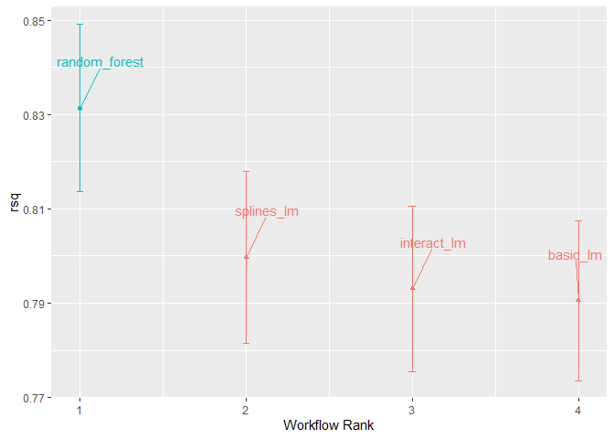
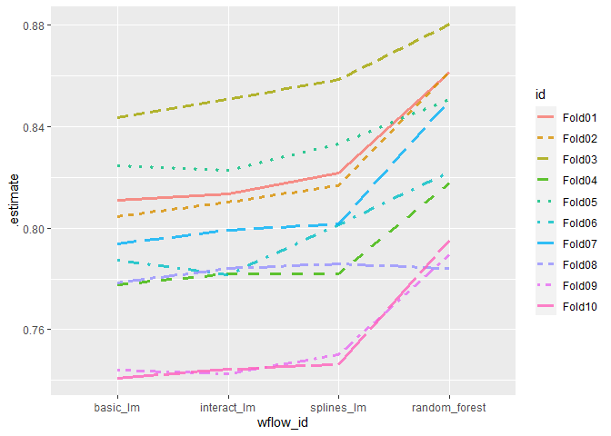
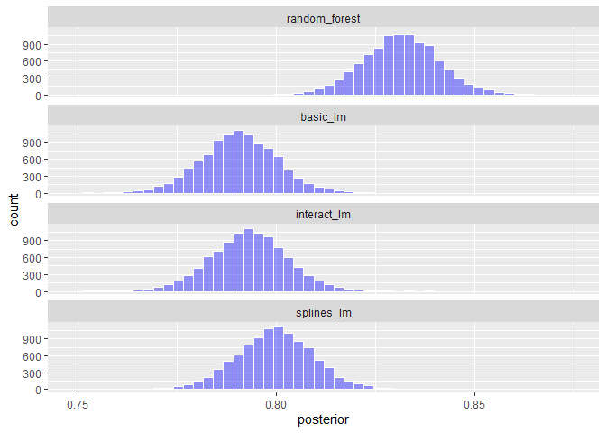
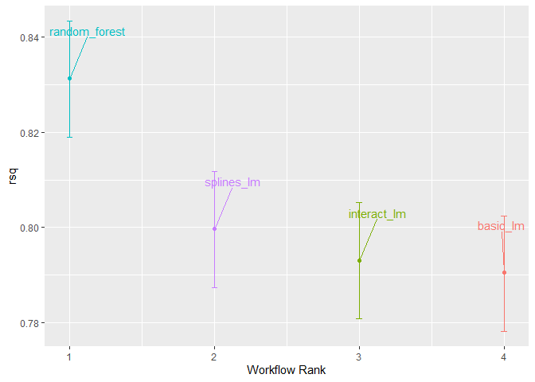
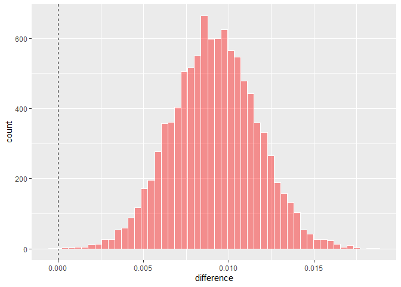
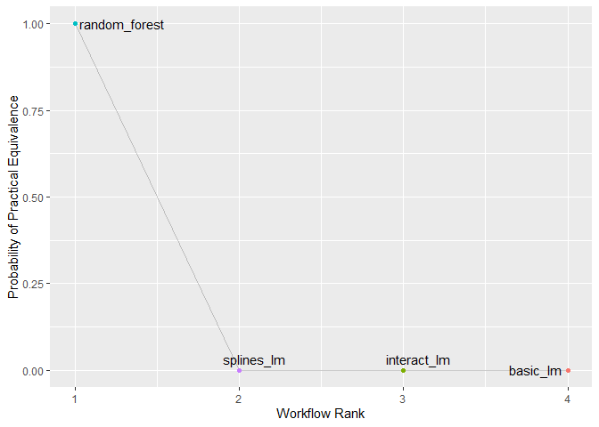

Comparing Models with Resampling
================
Mubarak Ganiyu
2022-06-14

#### Package Installation

``` r
library(tidymodels)
```

    ## -- Attaching packages -------------------------------------- tidymodels 0.2.0 --

    ## v broom        0.8.0     v recipes      0.2.0
    ## v dials        0.1.1     v rsample      0.1.1
    ## v dplyr        1.0.9     v tibble       3.1.6
    ## v ggplot2      3.3.5     v tidyr        1.2.0
    ## v infer        1.0.0     v tune         0.2.0
    ## v modeldata    0.1.1     v workflows    0.2.6
    ## v parsnip      0.2.1     v workflowsets 0.2.1
    ## v purrr        0.3.4     v yardstick    0.0.9

    ## -- Conflicts ----------------------------------------- tidymodels_conflicts() --
    ## x purrr::discard() masks scales::discard()
    ## x dplyr::filter()  masks stats::filter()
    ## x dplyr::lag()     masks stats::lag()
    ## x recipes::step()  masks stats::step()
    ## * Use suppressPackageStartupMessages() to eliminate package startup messages

``` r
tidymodels_prefer()
data(ames)
ames <- mutate(ames, Sale_Price = log10(Sale_Price))

set.seed(502)
ames_split <- initial_split(ames, prop = 0.80, strata = Sale_Price)
ames_train <- training(ames_split)
ames_test  <-  testing(ames_split)

ames_rec <-
  recipe(Sale_Price ~ Neighborhood + Gr_Liv_Area + Year_Built + Bldg_Type +
           Latitude + Longitude, data = ames_train) %>%
  step_log(Gr_Liv_Area, base = 10) %>%
  step_other(Neighborhood, threshold = 0.01) %>%
  step_dummy(all_nominal_predictors()) %>%
  step_interact( ~ Gr_Liv_Area:starts_with("Bldg_Type_") ) %>%
  step_ns(Latitude, Longitude, deg_free = 20)

lm_model <- linear_reg() %>% set_engine("lm")

lm_wflow <-
  workflow() %>%
  add_model(lm_model) %>%
  add_recipe(ames_rec)

lm_fit <- fit(lm_wflow, ames_train)

rf_model <-
  rand_forest(trees = 1000) %>%
  set_engine("ranger") %>%
  set_mode("regression")

rf_wflow <-
  workflow() %>%
  add_formula(
    Sale_Price ~ Neighborhood + Gr_Liv_Area + Year_Built + Bldg_Type +
      Latitude + Longitude) %>%
  add_model(rf_model)

set.seed(1001)
ames_folds <- vfold_cv(ames_train, v = 10)

keep_pred <- control_resamples(save_pred = TRUE, save_workflow = TRUE)

set.seed(1003)
rf_res <- rf_wflow %>% fit_resamples(resamples = ames_folds, control = keep_pred)
```

#### Creating Multiple models with workflow sets

``` r
library(tidymodels)
tidymodels_prefer()

basic_rec <-
  recipe(Sale_Price ~ Neighborhood + Gr_Liv_Area + Year_Built + Bldg_Type +
           Latitude + Longitude, data = ames_train) %>%
  step_log(Gr_Liv_Area, base = 10) %>%
  step_other(Neighborhood, threshold = 0.01) %>%
  step_dummy(all_nominal_predictors())

interaction_rec <-
  basic_rec %>%
  step_interact( ~ Gr_Liv_Area:starts_with("Bldg_Type_") )

spline_rec <-
  interaction_rec %>%
  step_ns(Latitude, Longitude, deg_free = 50)

preproc <-
  list(basic = basic_rec,
       interact = interaction_rec,
       splines = spline_rec
  )

lm_models <- workflow_set(preproc, list(lm = lm_model), cross = FALSE)
lm_models
```

    ## # A workflow set/tibble: 3 x 4
    ##   wflow_id    info             option    result    
    ##   <chr>       <list>           <list>    <list>    
    ## 1 basic_lm    <tibble [1 x 4]> <opts[0]> <list [0]>
    ## 2 interact_lm <tibble [1 x 4]> <opts[0]> <list [0]>
    ## 3 splines_lm  <tibble [1 x 4]> <opts[0]> <list [0]>

``` r
lm_models <-
  lm_models %>%
  workflow_map("fit_resamples",
               # Options to `workflow_map()`:
               seed = 1101, verbose = TRUE,
               # Options to `fit_resamples()`:
               resamples = ames_folds, control = keep_pred)
```

    ## i 1 of 3 resampling: basic_lm

    ## v 1 of 3 resampling: basic_lm (7.2s)

    ## i 2 of 3 resampling: interact_lm

    ## v 2 of 3 resampling: interact_lm (8.6s)

    ## i 3 of 3 resampling: splines_lm

    ## v 3 of 3 resampling: splines_lm (10.5s)

``` r
lm_models
```

    ## # A workflow set/tibble: 3 x 4
    ##   wflow_id    info             option    result   
    ##   <chr>       <list>           <list>    <list>   
    ## 1 basic_lm    <tibble [1 x 4]> <opts[2]> <rsmp[+]>
    ## 2 interact_lm <tibble [1 x 4]> <opts[2]> <rsmp[+]>
    ## 3 splines_lm  <tibble [1 x 4]> <opts[2]> <rsmp[+]>

``` r
collect_metrics(lm_models) %>%
  filter(.metric == "rmse")
```

    ## # A tibble: 3 x 9
    ##   wflow_id    .config     preproc model  .metric .estimator   mean     n std_err
    ##   <chr>       <chr>       <chr>   <chr>  <chr>   <chr>       <dbl> <int>   <dbl>
    ## 1 basic_lm    Preprocess~ recipe  linea~ rmse    standard   0.0803    10 0.00264
    ## 2 interact_lm Preprocess~ recipe  linea~ rmse    standard   0.0799    10 0.00272
    ## 3 splines_lm  Preprocess~ recipe  linea~ rmse    standard   0.0785    10 0.00282

``` r
## adding random forest model for comparison
four_models <-
  as_workflow_set(random_forest = rf_res) %>%
  bind_rows(lm_models)
four_models
```

    ## # A workflow set/tibble: 4 x 4
    ##   wflow_id      info             option    result   
    ##   <chr>         <list>           <list>    <list>   
    ## 1 random_forest <tibble [1 x 4]> <opts[0]> <rsmp[+]>
    ## 2 basic_lm      <tibble [1 x 4]> <opts[2]> <rsmp[+]>
    ## 3 interact_lm   <tibble [1 x 4]> <opts[2]> <rsmp[+]>
    ## 4 splines_lm    <tibble [1 x 4]> <opts[2]> <rsmp[+]>

``` r
library(ggrepel)
autoplot(four_models, metric = "rsq") +
  geom_text_repel(aes(label = wflow_id), nudge_x = 1/8, nudge_y = 1/100) +
  theme(legend.position = "none")
```

<!-- -->
\#### Comparing resampling to resampling performance

``` r
rsq_indiv_estimates <-
  collect_metrics(four_models, summarize = FALSE) %>%
  filter(.metric == "rsq")

rsq_wider <-
  rsq_indiv_estimates %>%
  select(wflow_id, .estimate, id) %>%
  pivot_wider(id_cols = "id", names_from = "wflow_id", values_from = ".estimate")

corrr::correlate(rsq_wider %>% select(-id), quiet = TRUE)
```

    ## # A tibble: 4 x 5
    ##   term          random_forest basic_lm interact_lm splines_lm
    ##   <chr>                 <dbl>    <dbl>       <dbl>      <dbl>
    ## 1 random_forest        NA        0.887       0.888      0.889
    ## 2 basic_lm              0.887   NA           0.993      0.997
    ## 3 interact_lm           0.888    0.993      NA          0.987
    ## 4 splines_lm            0.889    0.997       0.987     NA

``` r
rsq_indiv_estimates %>%
  mutate(wflow_id = reorder(wflow_id, .estimate)) %>%
  ggplot(aes(x = wflow_id, y = .estimate, group = id, color = id, lty = id)) +
  geom_line(alpha = .8, lwd = 1.25)
```

<!-- -->

``` r
rsq_wider %>%
  with(cor.test(basic_lm, splines_lm) ) %>%
  tidy() %>%
  select(estimate, starts_with("conf"))
```

    ## # A tibble: 1 x 3
    ##   estimate conf.low conf.high
    ##      <dbl>    <dbl>     <dbl>
    ## 1    0.997    0.987     0.999

#### Simple Hypothesis Testing Methods

``` r
compare_lm <-
  rsq_wider %>%
  mutate(difference = splines_lm - basic_lm)

lm(difference ~ 1, data = compare_lm) %>%
  tidy(conf.int = TRUE) %>%
  select(estimate, p.value, starts_with("conf"))
```

    ## # A tibble: 1 x 4
    ##   estimate   p.value conf.low conf.high
    ##      <dbl>     <dbl>    <dbl>     <dbl>
    ## 1  0.00913 0.0000256  0.00650    0.0118

``` r
# Alternatively, a paired t-test could also be used:
rsq_wider %>%
  with(t.test(splines_lm, basic_lm, paired = TRUE)) %>%
  tidy() %>%
  select(estimate, p.value, starts_with("conf"))
```

    ## # A tibble: 1 x 4
    ##   estimate   p.value conf.low conf.high
    ##      <dbl>     <dbl>    <dbl>     <dbl>
    ## 1  0.00913 0.0000256  0.00650    0.0118

#### Bayesian Methods

``` r
library(tidyposterior)
library(rstanarm)
```

    ## Loading required package: Rcpp

    ## 
    ## Attaching package: 'Rcpp'

    ## The following object is masked from 'package:rsample':
    ## 
    ##     populate

    ## This is rstanarm version 2.21.3

    ## - See https://mc-stan.org/rstanarm/articles/priors for changes to default priors!

    ## - Default priors may change, so it's safest to specify priors, even if equivalent to the defaults.

    ## - For execution on a local, multicore CPU with excess RAM we recommend calling

    ##   options(mc.cores = parallel::detectCores())

``` r
# The rstanarm package creates copious amounts of output; those results
# are not shown here but are worth inspecting for potential issues. The
# option `refresh = 0` can be used to eliminate the logging.
rsq_anova <-
  perf_mod(
    four_models,
    metric = "rsq",
    prior_intercept = rstanarm::student_t(df = 1),
    chains = 4,
    iter = 5000,
    seed = 1102
  )
```

    ## 
    ## SAMPLING FOR MODEL 'continuous' NOW (CHAIN 1).
    ## Chain 1: 
    ## Chain 1: Gradient evaluation took 0.001 seconds
    ## Chain 1: 1000 transitions using 10 leapfrog steps per transition would take 10 seconds.
    ## Chain 1: Adjust your expectations accordingly!
    ## Chain 1: 
    ## Chain 1: 
    ## Chain 1: Iteration:    1 / 5000 [  0%]  (Warmup)
    ## Chain 1: Iteration:  500 / 5000 [ 10%]  (Warmup)
    ## Chain 1: Iteration: 1000 / 5000 [ 20%]  (Warmup)
    ## Chain 1: Iteration: 1500 / 5000 [ 30%]  (Warmup)
    ## Chain 1: Iteration: 2000 / 5000 [ 40%]  (Warmup)
    ## Chain 1: Iteration: 2500 / 5000 [ 50%]  (Warmup)
    ## Chain 1: Iteration: 2501 / 5000 [ 50%]  (Sampling)
    ## Chain 1: Iteration: 3000 / 5000 [ 60%]  (Sampling)
    ## Chain 1: Iteration: 3500 / 5000 [ 70%]  (Sampling)
    ## Chain 1: Iteration: 4000 / 5000 [ 80%]  (Sampling)
    ## Chain 1: Iteration: 4500 / 5000 [ 90%]  (Sampling)
    ## Chain 1: Iteration: 5000 / 5000 [100%]  (Sampling)
    ## Chain 1: 
    ## Chain 1:  Elapsed Time: 9.144 seconds (Warm-up)
    ## Chain 1:                7.389 seconds (Sampling)
    ## Chain 1:                16.533 seconds (Total)
    ## Chain 1: 
    ## 
    ## SAMPLING FOR MODEL 'continuous' NOW (CHAIN 2).
    ## Chain 2: 
    ## Chain 2: Gradient evaluation took 0 seconds
    ## Chain 2: 1000 transitions using 10 leapfrog steps per transition would take 0 seconds.
    ## Chain 2: Adjust your expectations accordingly!
    ## Chain 2: 
    ## Chain 2: 
    ## Chain 2: Iteration:    1 / 5000 [  0%]  (Warmup)
    ## Chain 2: Iteration:  500 / 5000 [ 10%]  (Warmup)
    ## Chain 2: Iteration: 1000 / 5000 [ 20%]  (Warmup)
    ## Chain 2: Iteration: 1500 / 5000 [ 30%]  (Warmup)
    ## Chain 2: Iteration: 2000 / 5000 [ 40%]  (Warmup)
    ## Chain 2: Iteration: 2500 / 5000 [ 50%]  (Warmup)
    ## Chain 2: Iteration: 2501 / 5000 [ 50%]  (Sampling)
    ## Chain 2: Iteration: 3000 / 5000 [ 60%]  (Sampling)
    ## Chain 2: Iteration: 3500 / 5000 [ 70%]  (Sampling)
    ## Chain 2: Iteration: 4000 / 5000 [ 80%]  (Sampling)
    ## Chain 2: Iteration: 4500 / 5000 [ 90%]  (Sampling)
    ## Chain 2: Iteration: 5000 / 5000 [100%]  (Sampling)
    ## Chain 2: 
    ## Chain 2:  Elapsed Time: 10.196 seconds (Warm-up)
    ## Chain 2:                5.791 seconds (Sampling)
    ## Chain 2:                15.987 seconds (Total)
    ## Chain 2: 
    ## 
    ## SAMPLING FOR MODEL 'continuous' NOW (CHAIN 3).
    ## Chain 3: 
    ## Chain 3: Gradient evaluation took 0 seconds
    ## Chain 3: 1000 transitions using 10 leapfrog steps per transition would take 0 seconds.
    ## Chain 3: Adjust your expectations accordingly!
    ## Chain 3: 
    ## Chain 3: 
    ## Chain 3: Iteration:    1 / 5000 [  0%]  (Warmup)
    ## Chain 3: Iteration:  500 / 5000 [ 10%]  (Warmup)
    ## Chain 3: Iteration: 1000 / 5000 [ 20%]  (Warmup)
    ## Chain 3: Iteration: 1500 / 5000 [ 30%]  (Warmup)
    ## Chain 3: Iteration: 2000 / 5000 [ 40%]  (Warmup)
    ## Chain 3: Iteration: 2500 / 5000 [ 50%]  (Warmup)
    ## Chain 3: Iteration: 2501 / 5000 [ 50%]  (Sampling)
    ## Chain 3: Iteration: 3000 / 5000 [ 60%]  (Sampling)
    ## Chain 3: Iteration: 3500 / 5000 [ 70%]  (Sampling)
    ## Chain 3: Iteration: 4000 / 5000 [ 80%]  (Sampling)
    ## Chain 3: Iteration: 4500 / 5000 [ 90%]  (Sampling)
    ## Chain 3: Iteration: 5000 / 5000 [100%]  (Sampling)
    ## Chain 3: 
    ## Chain 3:  Elapsed Time: 9.636 seconds (Warm-up)
    ## Chain 3:                5.276 seconds (Sampling)
    ## Chain 3:                14.912 seconds (Total)
    ## Chain 3: 
    ## 
    ## SAMPLING FOR MODEL 'continuous' NOW (CHAIN 4).
    ## Chain 4: 
    ## Chain 4: Gradient evaluation took 0.001 seconds
    ## Chain 4: 1000 transitions using 10 leapfrog steps per transition would take 10 seconds.
    ## Chain 4: Adjust your expectations accordingly!
    ## Chain 4: 
    ## Chain 4: 
    ## Chain 4: Iteration:    1 / 5000 [  0%]  (Warmup)
    ## Chain 4: Iteration:  500 / 5000 [ 10%]  (Warmup)
    ## Chain 4: Iteration: 1000 / 5000 [ 20%]  (Warmup)
    ## Chain 4: Iteration: 1500 / 5000 [ 30%]  (Warmup)
    ## Chain 4: Iteration: 2000 / 5000 [ 40%]  (Warmup)
    ## Chain 4: Iteration: 2500 / 5000 [ 50%]  (Warmup)
    ## Chain 4: Iteration: 2501 / 5000 [ 50%]  (Sampling)
    ## Chain 4: Iteration: 3000 / 5000 [ 60%]  (Sampling)
    ## Chain 4: Iteration: 3500 / 5000 [ 70%]  (Sampling)
    ## Chain 4: Iteration: 4000 / 5000 [ 80%]  (Sampling)
    ## Chain 4: Iteration: 4500 / 5000 [ 90%]  (Sampling)
    ## Chain 4: Iteration: 5000 / 5000 [100%]  (Sampling)
    ## Chain 4: 
    ## Chain 4:  Elapsed Time: 9.11 seconds (Warm-up)
    ## Chain 4:                6.275 seconds (Sampling)
    ## Chain 4:                15.385 seconds (Total)
    ## Chain 4:

``` r
model_post <-
  rsq_anova %>%
  # Take a random sample from the posterior distribution
  # so set the seed again to be reproducible.
  tidy(seed = 1103)

glimpse(model_post)
```

    ## Rows: 40,000
    ## Columns: 2
    ## $ model     <chr> "random_forest", "random_forest", "random_forest", "random_f~
    ## $ posterior <dbl> 0.8229238, 0.8267745, 0.8306463, 0.8375525, 0.8377841, 0.839~

``` r
model_post %>%
  mutate(model = forcats::fct_inorder(model)) %>%
  ggplot(aes(x = posterior)) +
  geom_histogram(bins = 50, color = "white", fill = "blue", alpha = 0.4) +
  facet_wrap(~ model, ncol = 1)
```

<!-- -->

``` r
autoplot(rsq_anova) +
  geom_text_repel(aes(label = workflow), nudge_x = 1/8, nudge_y = 1/100) +
  theme(legend.position = "none")
```

<!-- -->

``` r
rqs_diff <-
  contrast_models(rsq_anova,
                  list_1 = "splines_lm",
                  list_2 = "basic_lm",
                  seed = 1104)

rqs_diff %>%
  as_tibble() %>%
  ggplot(aes(x = difference)) +
  geom_vline(xintercept = 0, lty = 2) +
  geom_histogram(bins = 50, color = "white", fill = "red", alpha = 0.4)
```

<!-- -->

``` r
summary(rqs_diff) %>%
  select(-starts_with("pract"))
```

    ## # A tibble: 1 x 6
    ##   contrast               probability    mean   lower  upper  size
    ##   <chr>                        <dbl>   <dbl>   <dbl>  <dbl> <dbl>
    ## 1 splines_lm vs basic_lm        1.00 0.00915 0.00510 0.0133     0

``` r
autoplot(rsq_anova, type = "ROPE", size = 0.02) +
  geom_text_repel(aes(label = workflow)) +
  theme(legend.position = "none")
```

<!-- -->

``` r
# calculations in extras/ames_posterior_intervals.R
#ggplot(intervals,
#       aes(x = resamples, y = mean)) +
#  geom_path() +
#  geom_ribbon(aes(ymin = lower, ymax = upper), fill = "red", alpha = .1) +
#  labs(x = "Number of Resamples (repeated 10-fold cross-validation)")
```
