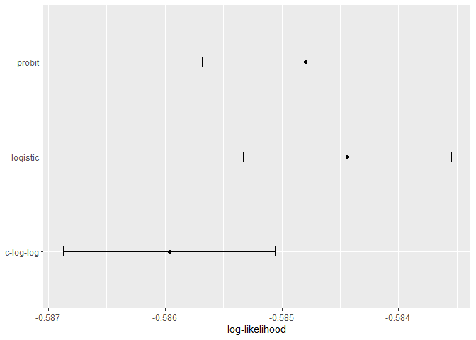

Model Tuning and the Dangers of Overfitting
================
Mubarak Ganiyu
2022-06-16

#### Loading data

``` r
library(tidymodels)
```

    ## -- Attaching packages -------------------------------------- tidymodels 0.2.0 --

    ## v broom        0.8.0     v recipes      0.2.0
    ## v dials        0.1.1     v rsample      0.1.1
    ## v dplyr        1.0.9     v tibble       3.1.6
    ## v ggplot2      3.3.5     v tidyr        1.2.0
    ## v infer        1.0.0     v tune         0.2.0
    ## v modeldata    0.1.1     v workflows    0.2.6
    ## v parsnip      0.2.1     v workflowsets 0.2.1
    ## v purrr        0.3.4     v yardstick    0.0.9

    ## -- Conflicts ----------------------------------------- tidymodels_conflicts() --
    ## x purrr::discard() masks scales::discard()
    ## x dplyr::filter()  masks stats::filter()
    ## x dplyr::lag()     masks stats::lag()
    ## x recipes::step()  masks stats::step()
    ## * Use suppressPackageStartupMessages() to eliminate package startup messages

``` r
tidymodels_prefer()
data(ames)
ames <- mutate(ames, Sale_Price = log10(Sale_Price))

set.seed(502)
ames_split <- initial_split(ames, prop = 0.80, strata = Sale_Price)
ames_train <- training(ames_split)
ames_test  <-  testing(ames_split)

ames_rec <-
  recipe(Sale_Price ~ Neighborhood + Gr_Liv_Area + Year_Built + Bldg_Type +
           Latitude + Longitude, data = ames_train) %>%
  step_log(Gr_Liv_Area, base = 10) %>%
  step_other(Neighborhood, threshold = 0.01) %>%
  step_dummy(all_nominal_predictors()) %>%
  step_interact( ~ Gr_Liv_Area:starts_with("Bldg_Type_") ) %>%
  step_ns(Latitude, Longitude, deg_free = 20)
train <- read.csv("train.csv")
test <- read.csv("test.csv")
train$Survived <- as.factor(train$Survived)
train_new <- train %>% 
  select(-PassengerId, -Name, -Cabin, -Ticket)
train_new$Sex <- as.factor(train_new$Sex)
train_new$Embarked <- as.factor(train_new$Embarked)
train_new
```

    ##     Survived Pclass    Sex   Age SibSp Parch     Fare Embarked
    ## 1          0      3   male 22.00     1     0   7.2500        S
    ## 2          1      1 female 38.00     1     0  71.2833        C
    ## 3          1      3 female 26.00     0     0   7.9250        S
    ## 4          1      1 female 35.00     1     0  53.1000        S
    ## 5          0      3   male 35.00     0     0   8.0500        S
    ## 6          0      3   male    NA     0     0   8.4583        Q
    ## 7          0      1   male 54.00     0     0  51.8625        S
    ## 8          0      3   male  2.00     3     1  21.0750        S
    ## 9          1      3 female 27.00     0     2  11.1333        S
    ## 10         1      2 female 14.00     1     0  30.0708        C
    ## 11         1      3 female  4.00     1     1  16.7000        S
    ## 12         1      1 female 58.00     0     0  26.5500        S
    ## 13         0      3   male 20.00     0     0   8.0500        S
    ## 14         0      3   male 39.00     1     5  31.2750        S
    ## 15         0      3 female 14.00     0     0   7.8542        S
    ## 16         1      2 female 55.00     0     0  16.0000        S
    ## 17         0      3   male  2.00     4     1  29.1250        Q
    ## 18         1      2   male    NA     0     0  13.0000        S
    ## 19         0      3 female 31.00     1     0  18.0000        S
    ## 20         1      3 female    NA     0     0   7.2250        C
    ## 21         0      2   male 35.00     0     0  26.0000        S
    ## 22         1      2   male 34.00     0     0  13.0000        S
    ## 23         1      3 female 15.00     0     0   8.0292        Q
    ## 24         1      1   male 28.00     0     0  35.5000        S
    ## 25         0      3 female  8.00     3     1  21.0750        S
    ## 26         1      3 female 38.00     1     5  31.3875        S
    ## 27         0      3   male    NA     0     0   7.2250        C
    ## 28         0      1   male 19.00     3     2 263.0000        S
    ## 29         1      3 female    NA     0     0   7.8792        Q
    ## 30         0      3   male    NA     0     0   7.8958        S
    ## 31         0      1   male 40.00     0     0  27.7208        C
    ## 32         1      1 female    NA     1     0 146.5208        C
    ## 33         1      3 female    NA     0     0   7.7500        Q
    ## 34         0      2   male 66.00     0     0  10.5000        S
    ## 35         0      1   male 28.00     1     0  82.1708        C
    ## 36         0      1   male 42.00     1     0  52.0000        S
    ## 37         1      3   male    NA     0     0   7.2292        C
    ## 38         0      3   male 21.00     0     0   8.0500        S
    ## 39         0      3 female 18.00     2     0  18.0000        S
    ## 40         1      3 female 14.00     1     0  11.2417        C
    ## 41         0      3 female 40.00     1     0   9.4750        S
    ## 42         0      2 female 27.00     1     0  21.0000        S
    ## 43         0      3   male    NA     0     0   7.8958        C
    ## 44         1      2 female  3.00     1     2  41.5792        C
    ## 45         1      3 female 19.00     0     0   7.8792        Q
    ## 46         0      3   male    NA     0     0   8.0500        S
    ## 47         0      3   male    NA     1     0  15.5000        Q
    ## 48         1      3 female    NA     0     0   7.7500        Q
    ## 49         0      3   male    NA     2     0  21.6792        C
    ## 50         0      3 female 18.00     1     0  17.8000        S
    ## 51         0      3   male  7.00     4     1  39.6875        S
    ## 52         0      3   male 21.00     0     0   7.8000        S
    ## 53         1      1 female 49.00     1     0  76.7292        C
    ## 54         1      2 female 29.00     1     0  26.0000        S
    ## 55         0      1   male 65.00     0     1  61.9792        C
    ## 56         1      1   male    NA     0     0  35.5000        S
    ## 57         1      2 female 21.00     0     0  10.5000        S
    ## 58         0      3   male 28.50     0     0   7.2292        C
    ## 59         1      2 female  5.00     1     2  27.7500        S
    ## 60         0      3   male 11.00     5     2  46.9000        S
    ## 61         0      3   male 22.00     0     0   7.2292        C
    ## 62         1      1 female 38.00     0     0  80.0000         
    ## 63         0      1   male 45.00     1     0  83.4750        S
    ## 64         0      3   male  4.00     3     2  27.9000        S
    ## 65         0      1   male    NA     0     0  27.7208        C
    ## 66         1      3   male    NA     1     1  15.2458        C
    ## 67         1      2 female 29.00     0     0  10.5000        S
    ## 68         0      3   male 19.00     0     0   8.1583        S
    ## 69         1      3 female 17.00     4     2   7.9250        S
    ## 70         0      3   male 26.00     2     0   8.6625        S
    ## 71         0      2   male 32.00     0     0  10.5000        S
    ## 72         0      3 female 16.00     5     2  46.9000        S
    ## 73         0      2   male 21.00     0     0  73.5000        S
    ## 74         0      3   male 26.00     1     0  14.4542        C
    ## 75         1      3   male 32.00     0     0  56.4958        S
    ## 76         0      3   male 25.00     0     0   7.6500        S
    ## 77         0      3   male    NA     0     0   7.8958        S
    ## 78         0      3   male    NA     0     0   8.0500        S
    ## 79         1      2   male  0.83     0     2  29.0000        S
    ## 80         1      3 female 30.00     0     0  12.4750        S
    ## 81         0      3   male 22.00     0     0   9.0000        S
    ## 82         1      3   male 29.00     0     0   9.5000        S
    ## 83         1      3 female    NA     0     0   7.7875        Q
    ## 84         0      1   male 28.00     0     0  47.1000        S
    ## 85         1      2 female 17.00     0     0  10.5000        S
    ## 86         1      3 female 33.00     3     0  15.8500        S
    ## 87         0      3   male 16.00     1     3  34.3750        S
    ## 88         0      3   male    NA     0     0   8.0500        S
    ## 89         1      1 female 23.00     3     2 263.0000        S
    ## 90         0      3   male 24.00     0     0   8.0500        S
    ## 91         0      3   male 29.00     0     0   8.0500        S
    ## 92         0      3   male 20.00     0     0   7.8542        S
    ## 93         0      1   male 46.00     1     0  61.1750        S
    ## 94         0      3   male 26.00     1     2  20.5750        S
    ## 95         0      3   male 59.00     0     0   7.2500        S
    ## 96         0      3   male    NA     0     0   8.0500        S
    ## 97         0      1   male 71.00     0     0  34.6542        C
    ## 98         1      1   male 23.00     0     1  63.3583        C
    ## 99         1      2 female 34.00     0     1  23.0000        S
    ## 100        0      2   male 34.00     1     0  26.0000        S
    ## 101        0      3 female 28.00     0     0   7.8958        S
    ## 102        0      3   male    NA     0     0   7.8958        S
    ## 103        0      1   male 21.00     0     1  77.2875        S
    ## 104        0      3   male 33.00     0     0   8.6542        S
    ## 105        0      3   male 37.00     2     0   7.9250        S
    ## 106        0      3   male 28.00     0     0   7.8958        S
    ## 107        1      3 female 21.00     0     0   7.6500        S
    ## 108        1      3   male    NA     0     0   7.7750        S
    ## 109        0      3   male 38.00     0     0   7.8958        S
    ## 110        1      3 female    NA     1     0  24.1500        Q
    ## 111        0      1   male 47.00     0     0  52.0000        S
    ## 112        0      3 female 14.50     1     0  14.4542        C
    ## 113        0      3   male 22.00     0     0   8.0500        S
    ## 114        0      3 female 20.00     1     0   9.8250        S
    ## 115        0      3 female 17.00     0     0  14.4583        C
    ## 116        0      3   male 21.00     0     0   7.9250        S
    ## 117        0      3   male 70.50     0     0   7.7500        Q
    ## 118        0      2   male 29.00     1     0  21.0000        S
    ## 119        0      1   male 24.00     0     1 247.5208        C
    ## 120        0      3 female  2.00     4     2  31.2750        S
    ## 121        0      2   male 21.00     2     0  73.5000        S
    ## 122        0      3   male    NA     0     0   8.0500        S
    ## 123        0      2   male 32.50     1     0  30.0708        C
    ## 124        1      2 female 32.50     0     0  13.0000        S
    ## 125        0      1   male 54.00     0     1  77.2875        S
    ## 126        1      3   male 12.00     1     0  11.2417        C
    ## 127        0      3   male    NA     0     0   7.7500        Q
    ## 128        1      3   male 24.00     0     0   7.1417        S
    ## 129        1      3 female    NA     1     1  22.3583        C
    ## 130        0      3   male 45.00     0     0   6.9750        S
    ## 131        0      3   male 33.00     0     0   7.8958        C
    ## 132        0      3   male 20.00     0     0   7.0500        S
    ## 133        0      3 female 47.00     1     0  14.5000        S
    ## 134        1      2 female 29.00     1     0  26.0000        S
    ## 135        0      2   male 25.00     0     0  13.0000        S
    ## 136        0      2   male 23.00     0     0  15.0458        C
    ## 137        1      1 female 19.00     0     2  26.2833        S
    ## 138        0      1   male 37.00     1     0  53.1000        S
    ## 139        0      3   male 16.00     0     0   9.2167        S
    ## 140        0      1   male 24.00     0     0  79.2000        C
    ## 141        0      3 female    NA     0     2  15.2458        C
    ## 142        1      3 female 22.00     0     0   7.7500        S
    ## 143        1      3 female 24.00     1     0  15.8500        S
    ## 144        0      3   male 19.00     0     0   6.7500        Q
    ## 145        0      2   male 18.00     0     0  11.5000        S
    ## 146        0      2   male 19.00     1     1  36.7500        S
    ## 147        1      3   male 27.00     0     0   7.7958        S
    ## 148        0      3 female  9.00     2     2  34.3750        S
    ## 149        0      2   male 36.50     0     2  26.0000        S
    ## 150        0      2   male 42.00     0     0  13.0000        S
    ## 151        0      2   male 51.00     0     0  12.5250        S
    ## 152        1      1 female 22.00     1     0  66.6000        S
    ## 153        0      3   male 55.50     0     0   8.0500        S
    ## 154        0      3   male 40.50     0     2  14.5000        S
    ## 155        0      3   male    NA     0     0   7.3125        S
    ## 156        0      1   male 51.00     0     1  61.3792        C
    ## 157        1      3 female 16.00     0     0   7.7333        Q
    ## 158        0      3   male 30.00     0     0   8.0500        S
    ## 159        0      3   male    NA     0     0   8.6625        S
    ## 160        0      3   male    NA     8     2  69.5500        S
    ## 161        0      3   male 44.00     0     1  16.1000        S
    ## 162        1      2 female 40.00     0     0  15.7500        S
    ## 163        0      3   male 26.00     0     0   7.7750        S
    ## 164        0      3   male 17.00     0     0   8.6625        S
    ## 165        0      3   male  1.00     4     1  39.6875        S
    ## 166        1      3   male  9.00     0     2  20.5250        S
    ## 167        1      1 female    NA     0     1  55.0000        S
    ## 168        0      3 female 45.00     1     4  27.9000        S
    ## 169        0      1   male    NA     0     0  25.9250        S
    ## 170        0      3   male 28.00     0     0  56.4958        S
    ## 171        0      1   male 61.00     0     0  33.5000        S
    ## 172        0      3   male  4.00     4     1  29.1250        Q
    ## 173        1      3 female  1.00     1     1  11.1333        S
    ## 174        0      3   male 21.00     0     0   7.9250        S
    ## 175        0      1   male 56.00     0     0  30.6958        C
    ## 176        0      3   male 18.00     1     1   7.8542        S
    ## 177        0      3   male    NA     3     1  25.4667        S
    ## 178        0      1 female 50.00     0     0  28.7125        C
    ## 179        0      2   male 30.00     0     0  13.0000        S
    ## 180        0      3   male 36.00     0     0   0.0000        S
    ## 181        0      3 female    NA     8     2  69.5500        S
    ## 182        0      2   male    NA     0     0  15.0500        C
    ## 183        0      3   male  9.00     4     2  31.3875        S
    ## 184        1      2   male  1.00     2     1  39.0000        S
    ## 185        1      3 female  4.00     0     2  22.0250        S
    ## 186        0      1   male    NA     0     0  50.0000        S
    ## 187        1      3 female    NA     1     0  15.5000        Q
    ## 188        1      1   male 45.00     0     0  26.5500        S
    ## 189        0      3   male 40.00     1     1  15.5000        Q
    ## 190        0      3   male 36.00     0     0   7.8958        S
    ## 191        1      2 female 32.00     0     0  13.0000        S
    ## 192        0      2   male 19.00     0     0  13.0000        S
    ## 193        1      3 female 19.00     1     0   7.8542        S
    ## 194        1      2   male  3.00     1     1  26.0000        S
    ## 195        1      1 female 44.00     0     0  27.7208        C
    ## 196        1      1 female 58.00     0     0 146.5208        C
    ## 197        0      3   male    NA     0     0   7.7500        Q
    ## 198        0      3   male 42.00     0     1   8.4042        S
    ## 199        1      3 female    NA     0     0   7.7500        Q
    ## 200        0      2 female 24.00     0     0  13.0000        S
    ## 201        0      3   male 28.00     0     0   9.5000        S
    ## 202        0      3   male    NA     8     2  69.5500        S
    ## 203        0      3   male 34.00     0     0   6.4958        S
    ## 204        0      3   male 45.50     0     0   7.2250        C
    ## 205        1      3   male 18.00     0     0   8.0500        S
    ## 206        0      3 female  2.00     0     1  10.4625        S
    ## 207        0      3   male 32.00     1     0  15.8500        S
    ## 208        1      3   male 26.00     0     0  18.7875        C
    ## 209        1      3 female 16.00     0     0   7.7500        Q
    ## 210        1      1   male 40.00     0     0  31.0000        C
    ## 211        0      3   male 24.00     0     0   7.0500        S
    ## 212        1      2 female 35.00     0     0  21.0000        S
    ## 213        0      3   male 22.00     0     0   7.2500        S
    ## 214        0      2   male 30.00     0     0  13.0000        S
    ## 215        0      3   male    NA     1     0   7.7500        Q
    ## 216        1      1 female 31.00     1     0 113.2750        C
    ## 217        1      3 female 27.00     0     0   7.9250        S
    ## 218        0      2   male 42.00     1     0  27.0000        S
    ## 219        1      1 female 32.00     0     0  76.2917        C
    ## 220        0      2   male 30.00     0     0  10.5000        S
    ## 221        1      3   male 16.00     0     0   8.0500        S
    ## 222        0      2   male 27.00     0     0  13.0000        S
    ## 223        0      3   male 51.00     0     0   8.0500        S
    ## 224        0      3   male    NA     0     0   7.8958        S
    ## 225        1      1   male 38.00     1     0  90.0000        S
    ## 226        0      3   male 22.00     0     0   9.3500        S
    ## 227        1      2   male 19.00     0     0  10.5000        S
    ## 228        0      3   male 20.50     0     0   7.2500        S
    ## 229        0      2   male 18.00     0     0  13.0000        S
    ## 230        0      3 female    NA     3     1  25.4667        S
    ## 231        1      1 female 35.00     1     0  83.4750        S
    ## 232        0      3   male 29.00     0     0   7.7750        S
    ## 233        0      2   male 59.00     0     0  13.5000        S
    ## 234        1      3 female  5.00     4     2  31.3875        S
    ## 235        0      2   male 24.00     0     0  10.5000        S
    ## 236        0      3 female    NA     0     0   7.5500        S
    ## 237        0      2   male 44.00     1     0  26.0000        S
    ## 238        1      2 female  8.00     0     2  26.2500        S
    ## 239        0      2   male 19.00     0     0  10.5000        S
    ## 240        0      2   male 33.00     0     0  12.2750        S
    ## 241        0      3 female    NA     1     0  14.4542        C
    ## 242        1      3 female    NA     1     0  15.5000        Q
    ## 243        0      2   male 29.00     0     0  10.5000        S
    ## 244        0      3   male 22.00     0     0   7.1250        S
    ## 245        0      3   male 30.00     0     0   7.2250        C
    ## 246        0      1   male 44.00     2     0  90.0000        Q
    ## 247        0      3 female 25.00     0     0   7.7750        S
    ## 248        1      2 female 24.00     0     2  14.5000        S
    ## 249        1      1   male 37.00     1     1  52.5542        S
    ## 250        0      2   male 54.00     1     0  26.0000        S
    ## 251        0      3   male    NA     0     0   7.2500        S
    ## 252        0      3 female 29.00     1     1  10.4625        S
    ## 253        0      1   male 62.00     0     0  26.5500        S
    ## 254        0      3   male 30.00     1     0  16.1000        S
    ## 255        0      3 female 41.00     0     2  20.2125        S
    ## 256        1      3 female 29.00     0     2  15.2458        C
    ## 257        1      1 female    NA     0     0  79.2000        C
    ## 258        1      1 female 30.00     0     0  86.5000        S
    ## 259        1      1 female 35.00     0     0 512.3292        C
    ## 260        1      2 female 50.00     0     1  26.0000        S
    ## 261        0      3   male    NA     0     0   7.7500        Q
    ## 262        1      3   male  3.00     4     2  31.3875        S
    ## 263        0      1   male 52.00     1     1  79.6500        S
    ## 264        0      1   male 40.00     0     0   0.0000        S
    ## 265        0      3 female    NA     0     0   7.7500        Q
    ## 266        0      2   male 36.00     0     0  10.5000        S
    ## 267        0      3   male 16.00     4     1  39.6875        S
    ## 268        1      3   male 25.00     1     0   7.7750        S
    ## 269        1      1 female 58.00     0     1 153.4625        S
    ## 270        1      1 female 35.00     0     0 135.6333        S
    ## 271        0      1   male    NA     0     0  31.0000        S
    ## 272        1      3   male 25.00     0     0   0.0000        S
    ## 273        1      2 female 41.00     0     1  19.5000        S
    ## 274        0      1   male 37.00     0     1  29.7000        C
    ## 275        1      3 female    NA     0     0   7.7500        Q
    ## 276        1      1 female 63.00     1     0  77.9583        S
    ## 277        0      3 female 45.00     0     0   7.7500        S
    ## 278        0      2   male    NA     0     0   0.0000        S
    ## 279        0      3   male  7.00     4     1  29.1250        Q
    ## 280        1      3 female 35.00     1     1  20.2500        S
    ## 281        0      3   male 65.00     0     0   7.7500        Q
    ## 282        0      3   male 28.00     0     0   7.8542        S
    ## 283        0      3   male 16.00     0     0   9.5000        S
    ## 284        1      3   male 19.00     0     0   8.0500        S
    ## 285        0      1   male    NA     0     0  26.0000        S
    ## 286        0      3   male 33.00     0     0   8.6625        C
    ## 287        1      3   male 30.00     0     0   9.5000        S
    ## 288        0      3   male 22.00     0     0   7.8958        S
    ## 289        1      2   male 42.00     0     0  13.0000        S
    ## 290        1      3 female 22.00     0     0   7.7500        Q
    ## 291        1      1 female 26.00     0     0  78.8500        S
    ## 292        1      1 female 19.00     1     0  91.0792        C
    ## 293        0      2   male 36.00     0     0  12.8750        C
    ## 294        0      3 female 24.00     0     0   8.8500        S
    ## 295        0      3   male 24.00     0     0   7.8958        S
    ## 296        0      1   male    NA     0     0  27.7208        C
    ## 297        0      3   male 23.50     0     0   7.2292        C
    ## 298        0      1 female  2.00     1     2 151.5500        S
    ## 299        1      1   male    NA     0     0  30.5000        S
    ## 300        1      1 female 50.00     0     1 247.5208        C
    ## 301        1      3 female    NA     0     0   7.7500        Q
    ## 302        1      3   male    NA     2     0  23.2500        Q
    ## 303        0      3   male 19.00     0     0   0.0000        S
    ## 304        1      2 female    NA     0     0  12.3500        Q
    ## 305        0      3   male    NA     0     0   8.0500        S
    ## 306        1      1   male  0.92     1     2 151.5500        S
    ## 307        1      1 female    NA     0     0 110.8833        C
    ## 308        1      1 female 17.00     1     0 108.9000        C
    ## 309        0      2   male 30.00     1     0  24.0000        C
    ## 310        1      1 female 30.00     0     0  56.9292        C
    ## 311        1      1 female 24.00     0     0  83.1583        C
    ## 312        1      1 female 18.00     2     2 262.3750        C
    ## 313        0      2 female 26.00     1     1  26.0000        S
    ## 314        0      3   male 28.00     0     0   7.8958        S
    ## 315        0      2   male 43.00     1     1  26.2500        S
    ## 316        1      3 female 26.00     0     0   7.8542        S
    ## 317        1      2 female 24.00     1     0  26.0000        S
    ## 318        0      2   male 54.00     0     0  14.0000        S
    ## 319        1      1 female 31.00     0     2 164.8667        S
    ## 320        1      1 female 40.00     1     1 134.5000        C
    ## 321        0      3   male 22.00     0     0   7.2500        S
    ## 322        0      3   male 27.00     0     0   7.8958        S
    ## 323        1      2 female 30.00     0     0  12.3500        Q
    ## 324        1      2 female 22.00     1     1  29.0000        S
    ## 325        0      3   male    NA     8     2  69.5500        S
    ## 326        1      1 female 36.00     0     0 135.6333        C
    ## 327        0      3   male 61.00     0     0   6.2375        S
    ## 328        1      2 female 36.00     0     0  13.0000        S
    ## 329        1      3 female 31.00     1     1  20.5250        S
    ## 330        1      1 female 16.00     0     1  57.9792        C
    ## 331        1      3 female    NA     2     0  23.2500        Q
    ## 332        0      1   male 45.50     0     0  28.5000        S
    ## 333        0      1   male 38.00     0     1 153.4625        S
    ## 334        0      3   male 16.00     2     0  18.0000        S
    ## 335        1      1 female    NA     1     0 133.6500        S
    ## 336        0      3   male    NA     0     0   7.8958        S
    ## 337        0      1   male 29.00     1     0  66.6000        S
    ## 338        1      1 female 41.00     0     0 134.5000        C
    ## 339        1      3   male 45.00     0     0   8.0500        S
    ## 340        0      1   male 45.00     0     0  35.5000        S
    ## 341        1      2   male  2.00     1     1  26.0000        S
    ## 342        1      1 female 24.00     3     2 263.0000        S
    ## 343        0      2   male 28.00     0     0  13.0000        S
    ## 344        0      2   male 25.00     0     0  13.0000        S
    ## 345        0      2   male 36.00     0     0  13.0000        S
    ## 346        1      2 female 24.00     0     0  13.0000        S
    ## 347        1      2 female 40.00     0     0  13.0000        S
    ## 348        1      3 female    NA     1     0  16.1000        S
    ## 349        1      3   male  3.00     1     1  15.9000        S
    ## 350        0      3   male 42.00     0     0   8.6625        S
    ## 351        0      3   male 23.00     0     0   9.2250        S
    ## 352        0      1   male    NA     0     0  35.0000        S
    ## 353        0      3   male 15.00     1     1   7.2292        C
    ## 354        0      3   male 25.00     1     0  17.8000        S
    ## 355        0      3   male    NA     0     0   7.2250        C
    ## 356        0      3   male 28.00     0     0   9.5000        S
    ## 357        1      1 female 22.00     0     1  55.0000        S
    ## 358        0      2 female 38.00     0     0  13.0000        S
    ## 359        1      3 female    NA     0     0   7.8792        Q
    ## 360        1      3 female    NA     0     0   7.8792        Q
    ## 361        0      3   male 40.00     1     4  27.9000        S
    ## 362        0      2   male 29.00     1     0  27.7208        C
    ## 363        0      3 female 45.00     0     1  14.4542        C
    ## 364        0      3   male 35.00     0     0   7.0500        S
    ## 365        0      3   male    NA     1     0  15.5000        Q
    ## 366        0      3   male 30.00     0     0   7.2500        S
    ## 367        1      1 female 60.00     1     0  75.2500        C
    ## 368        1      3 female    NA     0     0   7.2292        C
    ## 369        1      3 female    NA     0     0   7.7500        Q
    ## 370        1      1 female 24.00     0     0  69.3000        C
    ## 371        1      1   male 25.00     1     0  55.4417        C
    ## 372        0      3   male 18.00     1     0   6.4958        S
    ## 373        0      3   male 19.00     0     0   8.0500        S
    ## 374        0      1   male 22.00     0     0 135.6333        C
    ## 375        0      3 female  3.00     3     1  21.0750        S
    ## 376        1      1 female    NA     1     0  82.1708        C
    ## 377        1      3 female 22.00     0     0   7.2500        S
    ## 378        0      1   male 27.00     0     2 211.5000        C
    ## 379        0      3   male 20.00     0     0   4.0125        C
    ## 380        0      3   male 19.00     0     0   7.7750        S
    ## 381        1      1 female 42.00     0     0 227.5250        C
    ## 382        1      3 female  1.00     0     2  15.7417        C
    ## 383        0      3   male 32.00     0     0   7.9250        S
    ## 384        1      1 female 35.00     1     0  52.0000        S
    ## 385        0      3   male    NA     0     0   7.8958        S
    ## 386        0      2   male 18.00     0     0  73.5000        S
    ## 387        0      3   male  1.00     5     2  46.9000        S
    ## 388        1      2 female 36.00     0     0  13.0000        S
    ## 389        0      3   male    NA     0     0   7.7292        Q
    ## 390        1      2 female 17.00     0     0  12.0000        C
    ## 391        1      1   male 36.00     1     2 120.0000        S
    ## 392        1      3   male 21.00     0     0   7.7958        S
    ## 393        0      3   male 28.00     2     0   7.9250        S
    ## 394        1      1 female 23.00     1     0 113.2750        C
    ## 395        1      3 female 24.00     0     2  16.7000        S
    ## 396        0      3   male 22.00     0     0   7.7958        S
    ## 397        0      3 female 31.00     0     0   7.8542        S
    ## 398        0      2   male 46.00     0     0  26.0000        S
    ## 399        0      2   male 23.00     0     0  10.5000        S
    ## 400        1      2 female 28.00     0     0  12.6500        S
    ## 401        1      3   male 39.00     0     0   7.9250        S
    ## 402        0      3   male 26.00     0     0   8.0500        S
    ## 403        0      3 female 21.00     1     0   9.8250        S
    ## 404        0      3   male 28.00     1     0  15.8500        S
    ## 405        0      3 female 20.00     0     0   8.6625        S
    ## 406        0      2   male 34.00     1     0  21.0000        S
    ## 407        0      3   male 51.00     0     0   7.7500        S
    ## 408        1      2   male  3.00     1     1  18.7500        S
    ## 409        0      3   male 21.00     0     0   7.7750        S
    ## 410        0      3 female    NA     3     1  25.4667        S
    ## 411        0      3   male    NA     0     0   7.8958        S
    ## 412        0      3   male    NA     0     0   6.8583        Q
    ## 413        1      1 female 33.00     1     0  90.0000        Q
    ## 414        0      2   male    NA     0     0   0.0000        S
    ## 415        1      3   male 44.00     0     0   7.9250        S
    ## 416        0      3 female    NA     0     0   8.0500        S
    ## 417        1      2 female 34.00     1     1  32.5000        S
    ## 418        1      2 female 18.00     0     2  13.0000        S
    ## 419        0      2   male 30.00     0     0  13.0000        S
    ## 420        0      3 female 10.00     0     2  24.1500        S
    ## 421        0      3   male    NA     0     0   7.8958        C
    ## 422        0      3   male 21.00     0     0   7.7333        Q
    ## 423        0      3   male 29.00     0     0   7.8750        S
    ## 424        0      3 female 28.00     1     1  14.4000        S
    ## 425        0      3   male 18.00     1     1  20.2125        S
    ## 426        0      3   male    NA     0     0   7.2500        S
    ## 427        1      2 female 28.00     1     0  26.0000        S
    ## 428        1      2 female 19.00     0     0  26.0000        S
    ## 429        0      3   male    NA     0     0   7.7500        Q
    ## 430        1      3   male 32.00     0     0   8.0500        S
    ## 431        1      1   male 28.00     0     0  26.5500        S
    ## 432        1      3 female    NA     1     0  16.1000        S
    ## 433        1      2 female 42.00     1     0  26.0000        S
    ## 434        0      3   male 17.00     0     0   7.1250        S
    ## 435        0      1   male 50.00     1     0  55.9000        S
    ## 436        1      1 female 14.00     1     2 120.0000        S
    ## 437        0      3 female 21.00     2     2  34.3750        S
    ## 438        1      2 female 24.00     2     3  18.7500        S
    ## 439        0      1   male 64.00     1     4 263.0000        S
    ## 440        0      2   male 31.00     0     0  10.5000        S
    ## 441        1      2 female 45.00     1     1  26.2500        S
    ## 442        0      3   male 20.00     0     0   9.5000        S
    ## 443        0      3   male 25.00     1     0   7.7750        S
    ## 444        1      2 female 28.00     0     0  13.0000        S
    ## 445        1      3   male    NA     0     0   8.1125        S
    ## 446        1      1   male  4.00     0     2  81.8583        S
    ## 447        1      2 female 13.00     0     1  19.5000        S
    ## 448        1      1   male 34.00     0     0  26.5500        S
    ## 449        1      3 female  5.00     2     1  19.2583        C
    ## 450        1      1   male 52.00     0     0  30.5000        S
    ## 451        0      2   male 36.00     1     2  27.7500        S
    ## 452        0      3   male    NA     1     0  19.9667        S
    ## 453        0      1   male 30.00     0     0  27.7500        C
    ## 454        1      1   male 49.00     1     0  89.1042        C
    ## 455        0      3   male    NA     0     0   8.0500        S
    ## 456        1      3   male 29.00     0     0   7.8958        C
    ## 457        0      1   male 65.00     0     0  26.5500        S
    ## 458        1      1 female    NA     1     0  51.8625        S
    ## 459        1      2 female 50.00     0     0  10.5000        S
    ## 460        0      3   male    NA     0     0   7.7500        Q
    ## 461        1      1   male 48.00     0     0  26.5500        S
    ## 462        0      3   male 34.00     0     0   8.0500        S
    ## 463        0      1   male 47.00     0     0  38.5000        S
    ## 464        0      2   male 48.00     0     0  13.0000        S
    ## 465        0      3   male    NA     0     0   8.0500        S
    ## 466        0      3   male 38.00     0     0   7.0500        S
    ## 467        0      2   male    NA     0     0   0.0000        S
    ## 468        0      1   male 56.00     0     0  26.5500        S
    ## 469        0      3   male    NA     0     0   7.7250        Q
    ## 470        1      3 female  0.75     2     1  19.2583        C
    ## 471        0      3   male    NA     0     0   7.2500        S
    ## 472        0      3   male 38.00     0     0   8.6625        S
    ## 473        1      2 female 33.00     1     2  27.7500        S
    ## 474        1      2 female 23.00     0     0  13.7917        C
    ## 475        0      3 female 22.00     0     0   9.8375        S
    ## 476        0      1   male    NA     0     0  52.0000        S
    ## 477        0      2   male 34.00     1     0  21.0000        S
    ## 478        0      3   male 29.00     1     0   7.0458        S
    ## 479        0      3   male 22.00     0     0   7.5208        S
    ## 480        1      3 female  2.00     0     1  12.2875        S
    ## 481        0      3   male  9.00     5     2  46.9000        S
    ## 482        0      2   male    NA     0     0   0.0000        S
    ## 483        0      3   male 50.00     0     0   8.0500        S
    ## 484        1      3 female 63.00     0     0   9.5875        S
    ## 485        1      1   male 25.00     1     0  91.0792        C
    ## 486        0      3 female    NA     3     1  25.4667        S
    ## 487        1      1 female 35.00     1     0  90.0000        S
    ## 488        0      1   male 58.00     0     0  29.7000        C
    ## 489        0      3   male 30.00     0     0   8.0500        S
    ## 490        1      3   male  9.00     1     1  15.9000        S
    ## 491        0      3   male    NA     1     0  19.9667        S
    ## 492        0      3   male 21.00     0     0   7.2500        S
    ## 493        0      1   male 55.00     0     0  30.5000        S
    ## 494        0      1   male 71.00     0     0  49.5042        C
    ## 495        0      3   male 21.00     0     0   8.0500        S
    ## 496        0      3   male    NA     0     0  14.4583        C
    ## 497        1      1 female 54.00     1     0  78.2667        C
    ## 498        0      3   male    NA     0     0  15.1000        S
    ## 499        0      1 female 25.00     1     2 151.5500        S
    ## 500        0      3   male 24.00     0     0   7.7958        S
    ## 501        0      3   male 17.00     0     0   8.6625        S
    ## 502        0      3 female 21.00     0     0   7.7500        Q
    ## 503        0      3 female    NA     0     0   7.6292        Q
    ## 504        0      3 female 37.00     0     0   9.5875        S
    ## 505        1      1 female 16.00     0     0  86.5000        S
    ## 506        0      1   male 18.00     1     0 108.9000        C
    ## 507        1      2 female 33.00     0     2  26.0000        S
    ## 508        1      1   male    NA     0     0  26.5500        S
    ## 509        0      3   male 28.00     0     0  22.5250        S
    ## 510        1      3   male 26.00     0     0  56.4958        S
    ## 511        1      3   male 29.00     0     0   7.7500        Q
    ## 512        0      3   male    NA     0     0   8.0500        S
    ## 513        1      1   male 36.00     0     0  26.2875        S
    ## 514        1      1 female 54.00     1     0  59.4000        C
    ## 515        0      3   male 24.00     0     0   7.4958        S
    ## 516        0      1   male 47.00     0     0  34.0208        S
    ## 517        1      2 female 34.00     0     0  10.5000        S
    ## 518        0      3   male    NA     0     0  24.1500        Q
    ## 519        1      2 female 36.00     1     0  26.0000        S
    ## 520        0      3   male 32.00     0     0   7.8958        S
    ## 521        1      1 female 30.00     0     0  93.5000        S
    ## 522        0      3   male 22.00     0     0   7.8958        S
    ## 523        0      3   male    NA     0     0   7.2250        C
    ## 524        1      1 female 44.00     0     1  57.9792        C
    ## 525        0      3   male    NA     0     0   7.2292        C
    ## 526        0      3   male 40.50     0     0   7.7500        Q
    ## 527        1      2 female 50.00     0     0  10.5000        S
    ## 528        0      1   male    NA     0     0 221.7792        S
    ## 529        0      3   male 39.00     0     0   7.9250        S
    ## 530        0      2   male 23.00     2     1  11.5000        S
    ## 531        1      2 female  2.00     1     1  26.0000        S
    ## 532        0      3   male    NA     0     0   7.2292        C
    ## 533        0      3   male 17.00     1     1   7.2292        C
    ## 534        1      3 female    NA     0     2  22.3583        C
    ## 535        0      3 female 30.00     0     0   8.6625        S
    ## 536        1      2 female  7.00     0     2  26.2500        S
    ## 537        0      1   male 45.00     0     0  26.5500        S
    ## 538        1      1 female 30.00     0     0 106.4250        C
    ## 539        0      3   male    NA     0     0  14.5000        S
    ## 540        1      1 female 22.00     0     2  49.5000        C
    ## 541        1      1 female 36.00     0     2  71.0000        S
    ## 542        0      3 female  9.00     4     2  31.2750        S
    ## 543        0      3 female 11.00     4     2  31.2750        S
    ## 544        1      2   male 32.00     1     0  26.0000        S
    ## 545        0      1   male 50.00     1     0 106.4250        C
    ## 546        0      1   male 64.00     0     0  26.0000        S
    ## 547        1      2 female 19.00     1     0  26.0000        S
    ## 548        1      2   male    NA     0     0  13.8625        C
    ## 549        0      3   male 33.00     1     1  20.5250        S
    ## 550        1      2   male  8.00     1     1  36.7500        S
    ## 551        1      1   male 17.00     0     2 110.8833        C
    ## 552        0      2   male 27.00     0     0  26.0000        S
    ## 553        0      3   male    NA     0     0   7.8292        Q
    ## 554        1      3   male 22.00     0     0   7.2250        C
    ## 555        1      3 female 22.00     0     0   7.7750        S
    ## 556        0      1   male 62.00     0     0  26.5500        S
    ## 557        1      1 female 48.00     1     0  39.6000        C
    ## 558        0      1   male    NA     0     0 227.5250        C
    ## 559        1      1 female 39.00     1     1  79.6500        S
    ## 560        1      3 female 36.00     1     0  17.4000        S
    ## 561        0      3   male    NA     0     0   7.7500        Q
    ## 562        0      3   male 40.00     0     0   7.8958        S
    ## 563        0      2   male 28.00     0     0  13.5000        S
    ## 564        0      3   male    NA     0     0   8.0500        S
    ## 565        0      3 female    NA     0     0   8.0500        S
    ## 566        0      3   male 24.00     2     0  24.1500        S
    ## 567        0      3   male 19.00     0     0   7.8958        S
    ## 568        0      3 female 29.00     0     4  21.0750        S
    ## 569        0      3   male    NA     0     0   7.2292        C
    ## 570        1      3   male 32.00     0     0   7.8542        S
    ## 571        1      2   male 62.00     0     0  10.5000        S
    ## 572        1      1 female 53.00     2     0  51.4792        S
    ## 573        1      1   male 36.00     0     0  26.3875        S
    ## 574        1      3 female    NA     0     0   7.7500        Q
    ## 575        0      3   male 16.00     0     0   8.0500        S
    ## 576        0      3   male 19.00     0     0  14.5000        S
    ## 577        1      2 female 34.00     0     0  13.0000        S
    ## 578        1      1 female 39.00     1     0  55.9000        S
    ## 579        0      3 female    NA     1     0  14.4583        C
    ## 580        1      3   male 32.00     0     0   7.9250        S
    ## 581        1      2 female 25.00     1     1  30.0000        S
    ## 582        1      1 female 39.00     1     1 110.8833        C
    ## 583        0      2   male 54.00     0     0  26.0000        S
    ## 584        0      1   male 36.00     0     0  40.1250        C
    ## 585        0      3   male    NA     0     0   8.7125        C
    ## 586        1      1 female 18.00     0     2  79.6500        S
    ## 587        0      2   male 47.00     0     0  15.0000        S
    ## 588        1      1   male 60.00     1     1  79.2000        C
    ## 589        0      3   male 22.00     0     0   8.0500        S
    ## 590        0      3   male    NA     0     0   8.0500        S
    ## 591        0      3   male 35.00     0     0   7.1250        S
    ## 592        1      1 female 52.00     1     0  78.2667        C
    ## 593        0      3   male 47.00     0     0   7.2500        S
    ## 594        0      3 female    NA     0     2   7.7500        Q
    ## 595        0      2   male 37.00     1     0  26.0000        S
    ## 596        0      3   male 36.00     1     1  24.1500        S
    ## 597        1      2 female    NA     0     0  33.0000        S
    ## 598        0      3   male 49.00     0     0   0.0000        S
    ## 599        0      3   male    NA     0     0   7.2250        C
    ## 600        1      1   male 49.00     1     0  56.9292        C
    ## 601        1      2 female 24.00     2     1  27.0000        S
    ## 602        0      3   male    NA     0     0   7.8958        S
    ## 603        0      1   male    NA     0     0  42.4000        S
    ## 604        0      3   male 44.00     0     0   8.0500        S
    ## 605        1      1   male 35.00     0     0  26.5500        C
    ## 606        0      3   male 36.00     1     0  15.5500        S
    ## 607        0      3   male 30.00     0     0   7.8958        S
    ## 608        1      1   male 27.00     0     0  30.5000        S
    ## 609        1      2 female 22.00     1     2  41.5792        C
    ## 610        1      1 female 40.00     0     0 153.4625        S
    ## 611        0      3 female 39.00     1     5  31.2750        S
    ## 612        0      3   male    NA     0     0   7.0500        S
    ## 613        1      3 female    NA     1     0  15.5000        Q
    ## 614        0      3   male    NA     0     0   7.7500        Q
    ## 615        0      3   male 35.00     0     0   8.0500        S
    ## 616        1      2 female 24.00     1     2  65.0000        S
    ## 617        0      3   male 34.00     1     1  14.4000        S
    ## 618        0      3 female 26.00     1     0  16.1000        S
    ## 619        1      2 female  4.00     2     1  39.0000        S
    ## 620        0      2   male 26.00     0     0  10.5000        S
    ## 621        0      3   male 27.00     1     0  14.4542        C
    ## 622        1      1   male 42.00     1     0  52.5542        S
    ## 623        1      3   male 20.00     1     1  15.7417        C
    ## 624        0      3   male 21.00     0     0   7.8542        S
    ## 625        0      3   male 21.00     0     0  16.1000        S
    ## 626        0      1   male 61.00     0     0  32.3208        S
    ## 627        0      2   male 57.00     0     0  12.3500        Q
    ## 628        1      1 female 21.00     0     0  77.9583        S
    ## 629        0      3   male 26.00     0     0   7.8958        S
    ## 630        0      3   male    NA     0     0   7.7333        Q
    ## 631        1      1   male 80.00     0     0  30.0000        S
    ## 632        0      3   male 51.00     0     0   7.0542        S
    ## 633        1      1   male 32.00     0     0  30.5000        C
    ## 634        0      1   male    NA     0     0   0.0000        S
    ## 635        0      3 female  9.00     3     2  27.9000        S
    ## 636        1      2 female 28.00     0     0  13.0000        S
    ## 637        0      3   male 32.00     0     0   7.9250        S
    ## 638        0      2   male 31.00     1     1  26.2500        S
    ## 639        0      3 female 41.00     0     5  39.6875        S
    ## 640        0      3   male    NA     1     0  16.1000        S
    ## 641        0      3   male 20.00     0     0   7.8542        S
    ## 642        1      1 female 24.00     0     0  69.3000        C
    ## 643        0      3 female  2.00     3     2  27.9000        S
    ## 644        1      3   male    NA     0     0  56.4958        S
    ## 645        1      3 female  0.75     2     1  19.2583        C
    ## 646        1      1   male 48.00     1     0  76.7292        C
    ## 647        0      3   male 19.00     0     0   7.8958        S
    ## 648        1      1   male 56.00     0     0  35.5000        C
    ## 649        0      3   male    NA     0     0   7.5500        S
    ## 650        1      3 female 23.00     0     0   7.5500        S
    ## 651        0      3   male    NA     0     0   7.8958        S
    ## 652        1      2 female 18.00     0     1  23.0000        S
    ## 653        0      3   male 21.00     0     0   8.4333        S
    ## 654        1      3 female    NA     0     0   7.8292        Q
    ## 655        0      3 female 18.00     0     0   6.7500        Q
    ## 656        0      2   male 24.00     2     0  73.5000        S
    ## 657        0      3   male    NA     0     0   7.8958        S
    ## 658        0      3 female 32.00     1     1  15.5000        Q
    ## 659        0      2   male 23.00     0     0  13.0000        S
    ## 660        0      1   male 58.00     0     2 113.2750        C
    ## 661        1      1   male 50.00     2     0 133.6500        S
    ## 662        0      3   male 40.00     0     0   7.2250        C
    ## 663        0      1   male 47.00     0     0  25.5875        S
    ## 664        0      3   male 36.00     0     0   7.4958        S
    ## 665        1      3   male 20.00     1     0   7.9250        S
    ## 666        0      2   male 32.00     2     0  73.5000        S
    ## 667        0      2   male 25.00     0     0  13.0000        S
    ## 668        0      3   male    NA     0     0   7.7750        S
    ## 669        0      3   male 43.00     0     0   8.0500        S
    ## 670        1      1 female    NA     1     0  52.0000        S
    ## 671        1      2 female 40.00     1     1  39.0000        S
    ## 672        0      1   male 31.00     1     0  52.0000        S
    ## 673        0      2   male 70.00     0     0  10.5000        S
    ## 674        1      2   male 31.00     0     0  13.0000        S
    ## 675        0      2   male    NA     0     0   0.0000        S
    ## 676        0      3   male 18.00     0     0   7.7750        S
    ## 677        0      3   male 24.50     0     0   8.0500        S
    ## 678        1      3 female 18.00     0     0   9.8417        S
    ## 679        0      3 female 43.00     1     6  46.9000        S
    ## 680        1      1   male 36.00     0     1 512.3292        C
    ## 681        0      3 female    NA     0     0   8.1375        Q
    ## 682        1      1   male 27.00     0     0  76.7292        C
    ## 683        0      3   male 20.00     0     0   9.2250        S
    ## 684        0      3   male 14.00     5     2  46.9000        S
    ## 685        0      2   male 60.00     1     1  39.0000        S
    ## 686        0      2   male 25.00     1     2  41.5792        C
    ## 687        0      3   male 14.00     4     1  39.6875        S
    ## 688        0      3   male 19.00     0     0  10.1708        S
    ## 689        0      3   male 18.00     0     0   7.7958        S
    ## 690        1      1 female 15.00     0     1 211.3375        S
    ## 691        1      1   male 31.00     1     0  57.0000        S
    ## 692        1      3 female  4.00     0     1  13.4167        C
    ## 693        1      3   male    NA     0     0  56.4958        S
    ## 694        0      3   male 25.00     0     0   7.2250        C
    ## 695        0      1   male 60.00     0     0  26.5500        S
    ## 696        0      2   male 52.00     0     0  13.5000        S
    ## 697        0      3   male 44.00     0     0   8.0500        S
    ## 698        1      3 female    NA     0     0   7.7333        Q
    ## 699        0      1   male 49.00     1     1 110.8833        C
    ## 700        0      3   male 42.00     0     0   7.6500        S
    ## 701        1      1 female 18.00     1     0 227.5250        C
    ## 702        1      1   male 35.00     0     0  26.2875        S
    ## 703        0      3 female 18.00     0     1  14.4542        C
    ## 704        0      3   male 25.00     0     0   7.7417        Q
    ## 705        0      3   male 26.00     1     0   7.8542        S
    ## 706        0      2   male 39.00     0     0  26.0000        S
    ## 707        1      2 female 45.00     0     0  13.5000        S
    ## 708        1      1   male 42.00     0     0  26.2875        S
    ## 709        1      1 female 22.00     0     0 151.5500        S
    ## 710        1      3   male    NA     1     1  15.2458        C
    ## 711        1      1 female 24.00     0     0  49.5042        C
    ## 712        0      1   male    NA     0     0  26.5500        S
    ## 713        1      1   male 48.00     1     0  52.0000        S
    ## 714        0      3   male 29.00     0     0   9.4833        S
    ## 715        0      2   male 52.00     0     0  13.0000        S
    ## 716        0      3   male 19.00     0     0   7.6500        S
    ## 717        1      1 female 38.00     0     0 227.5250        C
    ## 718        1      2 female 27.00     0     0  10.5000        S
    ## 719        0      3   male    NA     0     0  15.5000        Q
    ## 720        0      3   male 33.00     0     0   7.7750        S
    ## 721        1      2 female  6.00     0     1  33.0000        S
    ## 722        0      3   male 17.00     1     0   7.0542        S
    ## 723        0      2   male 34.00     0     0  13.0000        S
    ## 724        0      2   male 50.00     0     0  13.0000        S
    ## 725        1      1   male 27.00     1     0  53.1000        S
    ## 726        0      3   male 20.00     0     0   8.6625        S
    ## 727        1      2 female 30.00     3     0  21.0000        S
    ## 728        1      3 female    NA     0     0   7.7375        Q
    ## 729        0      2   male 25.00     1     0  26.0000        S
    ## 730        0      3 female 25.00     1     0   7.9250        S
    ## 731        1      1 female 29.00     0     0 211.3375        S
    ## 732        0      3   male 11.00     0     0  18.7875        C
    ## 733        0      2   male    NA     0     0   0.0000        S
    ## 734        0      2   male 23.00     0     0  13.0000        S
    ## 735        0      2   male 23.00     0     0  13.0000        S
    ## 736        0      3   male 28.50     0     0  16.1000        S
    ## 737        0      3 female 48.00     1     3  34.3750        S
    ## 738        1      1   male 35.00     0     0 512.3292        C
    ## 739        0      3   male    NA     0     0   7.8958        S
    ## 740        0      3   male    NA     0     0   7.8958        S
    ## 741        1      1   male    NA     0     0  30.0000        S
    ## 742        0      1   male 36.00     1     0  78.8500        S
    ## 743        1      1 female 21.00     2     2 262.3750        C
    ## 744        0      3   male 24.00     1     0  16.1000        S
    ## 745        1      3   male 31.00     0     0   7.9250        S
    ## 746        0      1   male 70.00     1     1  71.0000        S
    ## 747        0      3   male 16.00     1     1  20.2500        S
    ## 748        1      2 female 30.00     0     0  13.0000        S
    ## 749        0      1   male 19.00     1     0  53.1000        S
    ## 750        0      3   male 31.00     0     0   7.7500        Q
    ## 751        1      2 female  4.00     1     1  23.0000        S
    ## 752        1      3   male  6.00     0     1  12.4750        S
    ## 753        0      3   male 33.00     0     0   9.5000        S
    ## 754        0      3   male 23.00     0     0   7.8958        S
    ## 755        1      2 female 48.00     1     2  65.0000        S
    ## 756        1      2   male  0.67     1     1  14.5000        S
    ## 757        0      3   male 28.00     0     0   7.7958        S
    ## 758        0      2   male 18.00     0     0  11.5000        S
    ## 759        0      3   male 34.00     0     0   8.0500        S
    ## 760        1      1 female 33.00     0     0  86.5000        S
    ## 761        0      3   male    NA     0     0  14.5000        S
    ## 762        0      3   male 41.00     0     0   7.1250        S
    ## 763        1      3   male 20.00     0     0   7.2292        C
    ## 764        1      1 female 36.00     1     2 120.0000        S
    ## 765        0      3   male 16.00     0     0   7.7750        S
    ## 766        1      1 female 51.00     1     0  77.9583        S
    ## 767        0      1   male    NA     0     0  39.6000        C
    ## 768        0      3 female 30.50     0     0   7.7500        Q
    ## 769        0      3   male    NA     1     0  24.1500        Q
    ## 770        0      3   male 32.00     0     0   8.3625        S
    ## 771        0      3   male 24.00     0     0   9.5000        S
    ## 772        0      3   male 48.00     0     0   7.8542        S
    ## 773        0      2 female 57.00     0     0  10.5000        S
    ## 774        0      3   male    NA     0     0   7.2250        C
    ## 775        1      2 female 54.00     1     3  23.0000        S
    ## 776        0      3   male 18.00     0     0   7.7500        S
    ## 777        0      3   male    NA     0     0   7.7500        Q
    ## 778        1      3 female  5.00     0     0  12.4750        S
    ## 779        0      3   male    NA     0     0   7.7375        Q
    ## 780        1      1 female 43.00     0     1 211.3375        S
    ## 781        1      3 female 13.00     0     0   7.2292        C
    ## 782        1      1 female 17.00     1     0  57.0000        S
    ## 783        0      1   male 29.00     0     0  30.0000        S
    ## 784        0      3   male    NA     1     2  23.4500        S
    ## 785        0      3   male 25.00     0     0   7.0500        S
    ## 786        0      3   male 25.00     0     0   7.2500        S
    ## 787        1      3 female 18.00     0     0   7.4958        S
    ## 788        0      3   male  8.00     4     1  29.1250        Q
    ## 789        1      3   male  1.00     1     2  20.5750        S
    ## 790        0      1   male 46.00     0     0  79.2000        C
    ## 791        0      3   male    NA     0     0   7.7500        Q
    ## 792        0      2   male 16.00     0     0  26.0000        S
    ## 793        0      3 female    NA     8     2  69.5500        S
    ## 794        0      1   male    NA     0     0  30.6958        C
    ## 795        0      3   male 25.00     0     0   7.8958        S
    ## 796        0      2   male 39.00     0     0  13.0000        S
    ## 797        1      1 female 49.00     0     0  25.9292        S
    ## 798        1      3 female 31.00     0     0   8.6833        S
    ## 799        0      3   male 30.00     0     0   7.2292        C
    ## 800        0      3 female 30.00     1     1  24.1500        S
    ## 801        0      2   male 34.00     0     0  13.0000        S
    ## 802        1      2 female 31.00     1     1  26.2500        S
    ## 803        1      1   male 11.00     1     2 120.0000        S
    ## 804        1      3   male  0.42     0     1   8.5167        C
    ## 805        1      3   male 27.00     0     0   6.9750        S
    ## 806        0      3   male 31.00     0     0   7.7750        S
    ## 807        0      1   male 39.00     0     0   0.0000        S
    ## 808        0      3 female 18.00     0     0   7.7750        S
    ## 809        0      2   male 39.00     0     0  13.0000        S
    ## 810        1      1 female 33.00     1     0  53.1000        S
    ## 811        0      3   male 26.00     0     0   7.8875        S
    ## 812        0      3   male 39.00     0     0  24.1500        S
    ## 813        0      2   male 35.00     0     0  10.5000        S
    ## 814        0      3 female  6.00     4     2  31.2750        S
    ## 815        0      3   male 30.50     0     0   8.0500        S
    ## 816        0      1   male    NA     0     0   0.0000        S
    ## 817        0      3 female 23.00     0     0   7.9250        S
    ## 818        0      2   male 31.00     1     1  37.0042        C
    ## 819        0      3   male 43.00     0     0   6.4500        S
    ## 820        0      3   male 10.00     3     2  27.9000        S
    ## 821        1      1 female 52.00     1     1  93.5000        S
    ## 822        1      3   male 27.00     0     0   8.6625        S
    ## 823        0      1   male 38.00     0     0   0.0000        S
    ## 824        1      3 female 27.00     0     1  12.4750        S
    ## 825        0      3   male  2.00     4     1  39.6875        S
    ## 826        0      3   male    NA     0     0   6.9500        Q
    ## 827        0      3   male    NA     0     0  56.4958        S
    ## 828        1      2   male  1.00     0     2  37.0042        C
    ## 829        1      3   male    NA     0     0   7.7500        Q
    ## 830        1      1 female 62.00     0     0  80.0000         
    ## 831        1      3 female 15.00     1     0  14.4542        C
    ## 832        1      2   male  0.83     1     1  18.7500        S
    ## 833        0      3   male    NA     0     0   7.2292        C
    ## 834        0      3   male 23.00     0     0   7.8542        S
    ## 835        0      3   male 18.00     0     0   8.3000        S
    ## 836        1      1 female 39.00     1     1  83.1583        C
    ## 837        0      3   male 21.00     0     0   8.6625        S
    ## 838        0      3   male    NA     0     0   8.0500        S
    ## 839        1      3   male 32.00     0     0  56.4958        S
    ## 840        1      1   male    NA     0     0  29.7000        C
    ## 841        0      3   male 20.00     0     0   7.9250        S
    ## 842        0      2   male 16.00     0     0  10.5000        S
    ## 843        1      1 female 30.00     0     0  31.0000        C
    ## 844        0      3   male 34.50     0     0   6.4375        C
    ## 845        0      3   male 17.00     0     0   8.6625        S
    ## 846        0      3   male 42.00     0     0   7.5500        S
    ## 847        0      3   male    NA     8     2  69.5500        S
    ## 848        0      3   male 35.00     0     0   7.8958        C
    ## 849        0      2   male 28.00     0     1  33.0000        S
    ## 850        1      1 female    NA     1     0  89.1042        C
    ## 851        0      3   male  4.00     4     2  31.2750        S
    ## 852        0      3   male 74.00     0     0   7.7750        S
    ## 853        0      3 female  9.00     1     1  15.2458        C
    ## 854        1      1 female 16.00     0     1  39.4000        S
    ## 855        0      2 female 44.00     1     0  26.0000        S
    ## 856        1      3 female 18.00     0     1   9.3500        S
    ## 857        1      1 female 45.00     1     1 164.8667        S
    ## 858        1      1   male 51.00     0     0  26.5500        S
    ## 859        1      3 female 24.00     0     3  19.2583        C
    ## 860        0      3   male    NA     0     0   7.2292        C
    ## 861        0      3   male 41.00     2     0  14.1083        S
    ## 862        0      2   male 21.00     1     0  11.5000        S
    ## 863        1      1 female 48.00     0     0  25.9292        S
    ## 864        0      3 female    NA     8     2  69.5500        S
    ## 865        0      2   male 24.00     0     0  13.0000        S
    ## 866        1      2 female 42.00     0     0  13.0000        S
    ## 867        1      2 female 27.00     1     0  13.8583        C
    ## 868        0      1   male 31.00     0     0  50.4958        S
    ## 869        0      3   male    NA     0     0   9.5000        S
    ## 870        1      3   male  4.00     1     1  11.1333        S
    ## 871        0      3   male 26.00     0     0   7.8958        S
    ## 872        1      1 female 47.00     1     1  52.5542        S
    ## 873        0      1   male 33.00     0     0   5.0000        S
    ## 874        0      3   male 47.00     0     0   9.0000        S
    ## 875        1      2 female 28.00     1     0  24.0000        C
    ## 876        1      3 female 15.00     0     0   7.2250        C
    ## 877        0      3   male 20.00     0     0   9.8458        S
    ## 878        0      3   male 19.00     0     0   7.8958        S
    ## 879        0      3   male    NA     0     0   7.8958        S
    ## 880        1      1 female 56.00     0     1  83.1583        C
    ## 881        1      2 female 25.00     0     1  26.0000        S
    ## 882        0      3   male 33.00     0     0   7.8958        S
    ## 883        0      3 female 22.00     0     0  10.5167        S
    ## 884        0      2   male 28.00     0     0  10.5000        S
    ## 885        0      3   male 25.00     0     0   7.0500        S
    ## 886        0      3 female 39.00     0     5  29.1250        Q
    ## 887        0      2   male 27.00     0     0  13.0000        S
    ## 888        1      1 female 19.00     0     0  30.0000        S
    ## 889        0      3 female    NA     1     2  23.4500        S
    ## 890        1      1   male 26.00     0     0  30.0000        C
    ## 891        0      3   male 32.00     0     0   7.7500        Q

``` r
library(tidymodels)
tidymodels_prefer()
train <- read.csv("train.csv")
test <- read.csv("test.csv")

llhood <- function(...) {
  logistic_reg() %>%
    set_engine("glm", ...) %>%
    fit(Survived ~ ., data = train_new) %>%
    glance() %>%
    select(logLik)
}

bind_rows(
  llhood(),
  llhood(family = binomial(link = "probit")),
  llhood(family = binomial(link = "cloglog"))
) %>%
  mutate(link = c("logit", "probit", "c-log-log"))  %>%
  arrange(desc(logLik))
```

    ## # A tibble: 3 x 2
    ##   logLik link     
    ##    <dbl> <chr>    
    ## 1  -315. c-log-log
    ## 2  -316. logit    
    ## 3  -317. probit

``` r
set.seed(1201)
rs <- vfold_cv(train_new, repeats = 10)

# Return the individual resampled performance estimates:
lloss <- function(...) {
  perf_meas <- metric_set(roc_auc, mn_log_loss)

  logistic_reg() %>%
    set_engine("glm", ...) %>%
    fit_resamples(Survived ~ Pclass + Age, rs, metrics = perf_meas) %>%
    collect_metrics(summarize = FALSE) %>%
    select(id, id2, .metric, .estimate)
}

resampled_res <-
  bind_rows(
    lloss()                                    %>% mutate(model = "logistic"),
    lloss(family = binomial(link = "probit"))  %>% mutate(model = "probit"),
    lloss(family = binomial(link = "cloglog")) %>% mutate(model = "c-log-log")
  ) %>%
  # Convert log-loss to log-likelihood:
  mutate(.estimate = ifelse(.metric == "mn_log_loss", -.estimate, .estimate)) %>%
  group_by(model, .metric) %>%
  summarize(
    mean = mean(.estimate, na.rm = TRUE),
    std_err = sd(.estimate, na.rm = TRUE) / sum(!is.na(.estimate)),
    .groups = "drop"
  )

resampled_res %>%
  filter(.metric == "mn_log_loss") %>%
  ggplot(aes(x = mean, y = model)) +
  geom_point() +
  geom_errorbar(aes(xmin = mean - 1.64 * std_err, xmax = mean + 1.64 * std_err),
                width = .1) +
  labs(y = NULL, x = "log-likelihood")
```

<!-- -->

#### Tuning Parameters in tidymodels

``` r
rand_forest(trees = 2000, min_n = 10) %>%                   # <- main arguments
  set_engine("ranger", regularization.factor = 0.5)         # <- engine-specific
```

    ## Random Forest Model Specification (unknown)
    ## 
    ## Main Arguments:
    ##   trees = 2000
    ##   min_n = 10
    ## 
    ## Engine-Specific Arguments:
    ##   regularization.factor = 0.5
    ## 
    ## Computational engine: ranger

``` r
neural_net_spec <-
  mlp(hidden_units = tune()) %>%
  set_engine("keras")
```

``` r
extract_parameter_set_dials(neural_net_spec)
```

    ## Collection of 1 parameters for tuning
    ## 
    ##    identifier         type    object
    ##  hidden_units hidden_units nparam[+]

``` r
ames_rec <-
  recipe(Sale_Price ~ Neighborhood + Gr_Liv_Area + Year_Built + Bldg_Type +
           Latitude + Longitude, data = ames_train)  %>%
  step_log(Gr_Liv_Area, base = 10) %>%
  step_other(Neighborhood, threshold = tune()) %>%
  step_dummy(all_nominal_predictors()) %>%
  step_interact( ~ Gr_Liv_Area:starts_with("Bldg_Type_") ) %>%
  step_ns(Longitude, deg_free = tune("longitude df")) %>%
  step_ns(Latitude,  deg_free = tune("latitude df"))

recipes_param <- extract_parameter_set_dials(ames_rec)
recipes_param
```

    ## Collection of 3 parameters for tuning
    ## 
    ##    identifier      type    object
    ##     threshold threshold nparam[+]
    ##  longitude df  deg_free nparam[+]
    ##   latitude df  deg_free nparam[+]

``` r
wflow_param <-
  workflow() %>%
  add_recipe(ames_rec) %>%
  add_model(neural_net_spec) %>%
  extract_parameter_set_dials()
wflow_param
```

    ## Collection of 4 parameters for tuning
    ## 
    ##    identifier         type    object
    ##  hidden_units hidden_units nparam[+]
    ##     threshold    threshold nparam[+]
    ##  longitude df     deg_free nparam[+]
    ##   latitude df     deg_free nparam[+]

``` r
hidden_units()
```

    ## # Hidden Units (quantitative)
    ## Range: [1, 10]

``` r
threshold()
```

    ## Threshold (quantitative)
    ## Range: [0, 1]

``` r
spline_degree()
```

    ## Piecewise Polynomial Degree (quantitative)
    ## Range: [1, 10]

``` r
wflow_param %>% extract_parameter_dials("threshold")
```

    ## Threshold (quantitative)
    ## Range: [0, 0.1]

``` r
extract_parameter_set_dials(ames_rec) %>%
  update(threshold = threshold(c(0.8, 1.0)))
```

    ## Collection of 3 parameters for tuning
    ## 
    ##    identifier      type    object
    ##     threshold threshold nparam[+]
    ##  longitude df  deg_free nparam[+]
    ##   latitude df  deg_free nparam[+]

``` r
rf_spec <-
  rand_forest(mtry = tune()) %>%
  set_engine("ranger", regularization.factor = tune("regularization"))

rf_param <- extract_parameter_set_dials(rf_spec)
rf_param
```

    ## Collection of 2 parameters for tuning
    ## 
    ##      identifier                  type    object
    ##            mtry                  mtry nparam[?]
    ##  regularization regularization.factor nparam[+]
    ## 
    ## Model parameters needing finalization:
    ##    # Randomly Selected Predictors ('mtry')
    ## 
    ## See `?dials::finalize` or `?dials::update.parameters` for more information.

``` r
rf_param %>%
  update(mtry = mtry(c(1, 70)))
```

    ## Collection of 2 parameters for tuning
    ## 
    ##      identifier                  type    object
    ##            mtry                  mtry nparam[+]
    ##  regularization regularization.factor nparam[+]

``` r
pca_rec <-
  recipe(Sale_Price ~ ., data = ames_train) %>%
  # Select the square-footage predictors and extract their PCA components:
  step_normalize(contains("SF")) %>%
  # Select the number of components needed to capture 95% of
  # the variance in the predictors.
  step_pca(contains("SF"), threshold = .95)

updated_param <-
  workflow() %>%
  add_model(rf_spec) %>%
  add_recipe(pca_rec) %>%
  extract_parameter_set_dials() %>%
  finalize(ames_train)

updated_param %>% extract_parameter_dials("mtry")
```

    ## # Randomly Selected Predictors (quantitative)
    ## Range: [1, 74]

``` r
rf_param
```

    ## Collection of 2 parameters for tuning
    ## 
    ##      identifier                  type    object
    ##            mtry                  mtry nparam[?]
    ##  regularization regularization.factor nparam[+]
    ## 
    ## Model parameters needing finalization:
    ##    # Randomly Selected Predictors ('mtry')
    ## 
    ## See `?dials::finalize` or `?dials::update.parameters` for more information.

``` r
regularization_factor()
```

    ## Gain Penalization (quantitative)
    ## Range: [0, 1]

``` r
penalty()
```

    ## Amount of Regularization (quantitative)
    ## Transformer:  log-10 
    ## Range (transformed scale): [-10, 0]

``` r
# correct method to have penalty values between 0.1 and 1.0
penalty(c(-1, 0)) %>% value_sample(1000) %>% summary()
```

    ##    Min. 1st Qu.  Median    Mean 3rd Qu.    Max. 
    ##  0.1003  0.1725  0.3032  0.3842  0.5491  0.9991

``` r
# incorrect:
penalty(c(0.1, 1.0)) %>% value_sample(1000) %>% summary()
```

    ##    Min. 1st Qu.  Median    Mean 3rd Qu.    Max. 
    ##   1.259   2.164   3.736   4.362   6.287  10.000

``` r
penalty(trans = NULL, range = 10^c(-10, 0))
```

    ## Amount of Regularization (quantitative)
    ## Range: [1e-10, 1]
