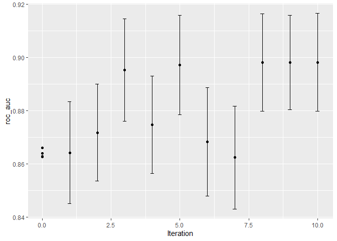

Iterative Search
================
Mubarak Ganiyu
2022-06-18

#### Package Installation

``` r
library(tidymodels)
```

    ## -- Attaching packages -------------------------------------- tidymodels 0.2.0 --

    ## v broom        0.8.0     v recipes      0.2.0
    ## v dials        0.1.1     v rsample      0.1.1
    ## v dplyr        1.0.9     v tibble       3.1.6
    ## v ggplot2      3.3.5     v tidyr        1.2.0
    ## v infer        1.0.0     v tune         0.2.0
    ## v modeldata    0.1.1     v workflows    0.2.6
    ## v parsnip      0.2.1     v workflowsets 0.2.1
    ## v purrr        0.3.4     v yardstick    0.0.9

    ## -- Conflicts ----------------------------------------- tidymodels_conflicts() --
    ## x purrr::discard() masks scales::discard()
    ## x dplyr::filter()  masks stats::filter()
    ## x dplyr::lag()     masks stats::lag()
    ## x recipes::step()  masks stats::step()
    ## * Use tidymodels_prefer() to resolve common conflicts.

``` r
tidymodels_prefer()

data(cells)
cells <- cells %>% select(-case)

set.seed(1304)
cell_folds <- vfold_cv(cells)

roc_res <- metric_set(roc_auc)
```

#### The Support Vector Machine Model

``` r
svm_rec <-
  recipe(class ~ ., data = cells) %>%
  step_YeoJohnson(all_numeric_predictors()) %>%
  step_normalize(all_numeric_predictors())

svm_spec <-
  svm_rbf(cost = tune(), rbf_sigma = tune()) %>%
  set_engine("kernlab") %>%
  set_mode("classification")

svm_wflow <-
  workflow() %>%
  add_model(svm_spec) %>%
  add_recipe(svm_rec)
```

``` r
cost()
```

    ## Cost (quantitative)
    ## Transformer:  log-2 
    ## Range (transformed scale): [-10, 5]

``` r
rbf_sigma()
```

    ## Radial Basis Function sigma (quantitative)
    ## Transformer:  log-10 
    ## Range (transformed scale): [-10, 0]

``` r
svm_param <-
  svm_wflow %>%
  extract_parameter_set_dials() %>%
  update(rbf_sigma = rbf_sigma(c(-7, -1)))
```

``` r
set.seed(1401)
start_grid <-
  svm_param %>%
  update(
    cost = cost(c(-6, 1)),
    rbf_sigma = rbf_sigma(c(-6, -4))
  ) %>%
  grid_regular(levels = 2)

set.seed(1402)
svm_initial <-
  svm_wflow %>%
  tune_grid(resamples = cell_folds, grid = start_grid, metrics = roc_res)

collect_metrics(svm_initial)
```

    ## # A tibble: 4 x 8
    ##     cost rbf_sigma .metric .estimator  mean     n std_err .config             
    ##    <dbl>     <dbl> <chr>   <chr>      <dbl> <int>   <dbl> <chr>               
    ## 1 0.0156  0.000001 roc_auc binary     0.864    10 0.00864 Preprocessor1_Model1
    ## 2 2       0.000001 roc_auc binary     0.863    10 0.00867 Preprocessor1_Model2
    ## 3 0.0156  0.0001   roc_auc binary     0.863    10 0.00862 Preprocessor1_Model3
    ## 4 2       0.0001   roc_auc binary     0.866    10 0.00855 Preprocessor1_Model4

#### Bayesian Optimization

``` r
ctrl <- control_bayes(verbose = TRUE)

set.seed(1403)
svm_bo <-
  svm_wflow %>%
  tune_bayes(
    resamples = cell_folds,
    metrics = roc_res,
    initial = svm_initial,
    param_info = svm_param,
    iter = 10,
    control = ctrl
  )
```

    ## Optimizing roc_auc using the expected improvement

    ## 

    ## -- Iteration 1 -----------------------------------------------------------------

    ## 

    ## i Current best:      roc_auc=0.8659 (@iter 0)

    ## i Gaussian process model

    ## v Gaussian process model

    ## i Generating 5000 candidates

    ## i Predicted candidates

    ## i cost=0.0019, rbf_sigma=8.46e-07

    ## i Estimating performance

    ## v Estimating performance

    ## (x) Newest results:  roc_auc=0.8642 (+/-0.00862)

    ## 

    ## -- Iteration 2 -----------------------------------------------------------------

    ## 

    ## i Current best:      roc_auc=0.8659 (@iter 0)

    ## i Gaussian process model

    ## v Gaussian process model

    ## i Generating 5000 candidates

    ## i Predicted candidates

    ## i cost=6.7, rbf_sigma=0.000102

    ## i Estimating performance

    ## v Estimating performance

    ## <3 Newest results:   roc_auc=0.8717 (+/-0.00816)

    ## 

    ## -- Iteration 3 -----------------------------------------------------------------

    ## 

    ## i Current best:      roc_auc=0.8717 (@iter 2)

    ## i Gaussian process model

    ## v Gaussian process model

    ## i Generating 5000 candidates

    ## i Predicted candidates

    ## i cost=5.8, rbf_sigma=0.00191

    ## i Estimating performance

    ## v Estimating performance

    ## <3 Newest results:   roc_auc=0.8952 (+/-0.00863)

    ## 

    ## -- Iteration 4 -----------------------------------------------------------------

    ## 

    ## i Current best:      roc_auc=0.8952 (@iter 3)

    ## i Gaussian process model

    ## v Gaussian process model

    ## i Generating 5000 candidates

    ## i Predicted candidates

    ## i cost=0.322, rbf_sigma=0.00184

    ## i Estimating performance

    ## v Estimating performance

    ## (x) Newest results:  roc_auc=0.8747 (+/-0.00824)

    ## 

    ## -- Iteration 5 -----------------------------------------------------------------

    ## 

    ## i Current best:      roc_auc=0.8952 (@iter 3)

    ## i Gaussian process model

    ## v Gaussian process model

    ## i Generating 5000 candidates

    ## i Predicted candidates

    ## i cost=5.76, rbf_sigma=0.00573

    ## i Estimating performance

    ## v Estimating performance

    ## <3 Newest results:   roc_auc=0.8971 (+/-0.00837)

    ## 

    ## -- Iteration 6 -----------------------------------------------------------------

    ## 

    ## i Current best:      roc_auc=0.8971 (@iter 5)

    ## i Gaussian process model

    ## v Gaussian process model

    ## i Generating 5000 candidates

    ## i Predicted candidates

    ## i cost=5.63, rbf_sigma=0.0343

    ## i Estimating performance

    ## v Estimating performance

    ## (x) Newest results:  roc_auc=0.8683 (+/-0.00918)

    ## 

    ## -- Iteration 7 -----------------------------------------------------------------

    ## 

    ## i Current best:      roc_auc=0.8971 (@iter 5)

    ## i Gaussian process model

    ## v Gaussian process model

    ## i Generating 5000 candidates

    ## i Predicted candidates

    ## i cost=5.77, rbf_sigma=5.89e-06

    ## i Estimating performance

    ## v Estimating performance

    ## (x) Newest results:  roc_auc=0.8624 (+/-0.00868)

    ## 

    ## -- Iteration 8 -----------------------------------------------------------------

    ## 

    ## i Current best:      roc_auc=0.8971 (@iter 5)

    ## i Gaussian process model

    ## v Gaussian process model

    ## i Generating 5000 candidates

    ## i Predicted candidates

    ## i cost=11, rbf_sigma=0.00345

    ## i Estimating performance

    ## v Estimating performance

    ## <3 Newest results:   roc_auc=0.8981 (+/-0.00822)

    ## 

    ## -- Iteration 9 -----------------------------------------------------------------

    ## 

    ## i Current best:      roc_auc=0.8981 (@iter 8)

    ## i Gaussian process model

    ## v Gaussian process model

    ## i Generating 5000 candidates

    ## i Predicted candidates

    ## i cost=6.71, rbf_sigma=0.00392

    ## i Estimating performance

    ## v Estimating performance

    ## <3 Newest results:   roc_auc=0.8981 (+/-0.00797)

    ## 

    ## -- Iteration 10 ----------------------------------------------------------------

    ## 

    ## i Current best:      roc_auc=0.8981 (@iter 9)

    ## i Gaussian process model

    ## v Gaussian process model

    ## i Generating 5000 candidates

    ## i Predicted candidates

    ## i cost=7.77, rbf_sigma=0.00452

    ## i Estimating performance

    ## v Estimating performance

    ## <3 Newest results:   roc_auc=0.8981 (+/-0.00827)

``` r
show_best(svm_bo)
```

    ## # A tibble: 5 x 9
    ##    cost rbf_sigma .metric .estimator  mean     n std_err .config .iter
    ##   <dbl>     <dbl> <chr>   <chr>      <dbl> <int>   <dbl> <chr>   <int>
    ## 1  7.77   0.00452 roc_auc binary     0.898    10 0.00827 Iter10     10
    ## 2  6.71   0.00392 roc_auc binary     0.898    10 0.00797 Iter9       9
    ## 3 11.0    0.00345 roc_auc binary     0.898    10 0.00822 Iter8       8
    ## 4  5.76   0.00573 roc_auc binary     0.897    10 0.00837 Iter5       5
    ## 5  5.80   0.00191 roc_auc binary     0.895    10 0.00863 Iter3       3

``` r
autoplot(svm_bo, type = "performance")
```

<!-- -->
